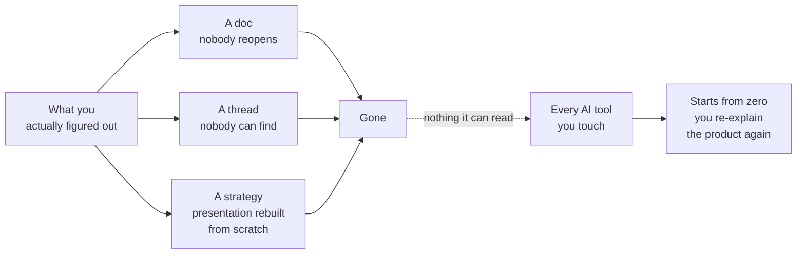
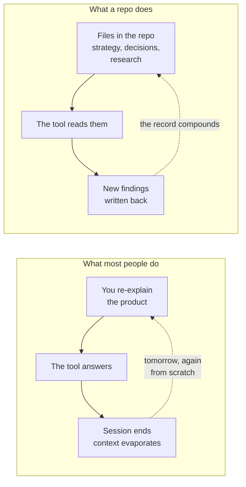
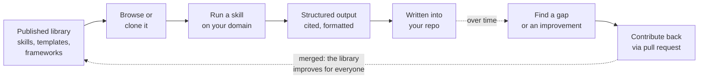

# Beyond the Backlog: How GitHub Compounds Your Product Team's Thinking

*Your best thinking is dying in three places right now.*

A Notion doc nobody reopens. A Slack thread nobody can find. A strategy presentation rebuilt from scratch every quarter because the last one is "somewhere in the drive."

Meanwhile, every AI tool your team touches starts from zero. You paste context into a chat window, get something useful back, and watch it vanish when the session ends. Tomorrow you will re-explain your product to the same tool, from scratch, again.

The hard part is not creating another document. It is keeping the team oriented while everything around the document changes: what you know, what you decided, what you rejected, and why.

GitHub solves that problem. Not as a developer tool you are borrowing. As the layer underneath your product work where thinking compounds instead of evaporating.

---

## What GitHub actually is (for you)

Search "GitHub for product managers" and you get a vocabulary lesson: repo, branch, commit, merge. Then a suggestion that it is an alternative to Jira or Trello. Wrong answer to the wrong question.

GitHub is not Jira with a different logo. Think of it as part digital vault, part publishing platform, part collaboration space, and part institutional memory.

The version-control layer underneath does not care whether the files are source code, research notes, a decision record, or a competitive brief. It tracks what changed, who changed it, and why, the same way for all of them. The collaboration layer on top adds discussions, reviews, permissions, and automation that coordinate people, not just files.

Not everything belongs there. Not everything should be public. And nobody is being asked to become a developer. If GitHub has always looked like an engineering cockpit, start smaller: learn what to look at, ask an AI assistant to explain what you are seeing, and make one small product note reviewable. What follows are seven capabilities that answer one question: does your product team have a place where its thinking can compound?

---

## 1. Share: a home for what your team actually knows

**The problem:** your team's understanding of the product lives in one person's head, gets re-explained on demand, and survives only as long as that person stays.

A repository gives the team a single place where research, strategy, decisions, and evidence live together. Not a wiki with flat pages, not a folder hierarchy, not a document that one person "owns" and everyone else reads a stale copy of. A versioned workspace where every change is tracked and nothing silently disappears.

In practice: a product manager working a new domain creates a private repo with a README explaining what the domain is and why the team cares, then stub files for what they know, what they do not know yet, and where they are looking. The files start near-empty, and that is honest. The value is not the content on day one. The value is that when someone asks "what do we know about this?" six months from now, the answer is a link, not a meeting.

**In plain English:** the commit history on those two files IS your strategy timeline. No more "ask the one person who remembers why we cut that feature."

**The honest limit:** a repository will not make anyone write things down. It is a place for the record, not a reason to keep one. If your team does not currently write decisions anywhere, this changes where nothing gets written.

---

## 2. Collaborate: the cheapest disagreement you will ever have

**The problem:** disagreements happen in threads that scroll away. The same argument restarts every quarter because nobody can find why a request was declined.

GitHub Issues and Discussions give the team two distinct registers. A Discussion asks "should we do something about this?" An Issue says "we have decided to investigate or change this." The distinction matters: one is exploratory, the other is a commitment. Both are written down, attached to the thing they are about, and dated.

In practice: one person questions a metric choice in an Issue. Another responds. The disagreement is now permanent, searchable, and attached to the file it concerns, not buried in a Slack thread from April that everyone has already scrolled past.

**In plain English:** arguing in an issue costs nothing. Arguing in a roadmap costs a quarter.

**The honest limit:** GitHub will not make people comment. Adoption is a people problem and the tool does not solve it. Expect to seed the first several discussions yourself, and expect some colleagues to reply by email anyway.

---

## 3. Review: make changes reviewable before they become truth

**The problem:** someone changes the positioning document, the pricing logic, or the competitive brief, and nobody sees it until the next all-hands. By then it is "what we believe" and challenging it feels like challenging a person.

Pull requests let the team review a proposed change before it becomes the accepted version. The diff shows exactly what changed. The conversation happens next to the change, not in a separate channel. And the review trail is permanent: six months from now you can see who approved the shift and what they said about it.

In practice: a product manager improves a shared skill based on what they have seen work in real deals. Instead of silently updating the file everyone trusts, they open a pull request. A colleague reviews, leaves a comment, and approves. The improvement is now the team's, with receipts.

**In plain English:** a pull request turns "I changed it" into "I proposed it, you reviewed it, we accepted it."

**The honest limit:** review only works if someone actually reviews. A pull request that sits open for two weeks is worse than no process at all, because it adds friction without adding judgment. Set a norm: review within one business day, or say why you cannot.

---

## 4. Trace: see what changed, who changed it, and why

**The problem:** the strategy shifted sometime last quarter. Nobody remembers exactly when, or what the old version said, or whether the shift was a deliberate decision or an accident.

Every change in a repository is a commit with a timestamp, an author, and a message explaining why. That history is not a log you have to remember to maintain. It is automatic. Edit a file, describe what you changed and why, and the record exists forever.

In practice: a competitive brief says something different than it said in March. You open the file's history and see the exact edit, who made it, when, and the commit message that says "updated after Q1 loss review, added deal-context section because three enterprise deals cited the same objection." That is not a changelog someone maintained. It is the actual record of what happened.

**In plain English:** you can revert a belief. You cannot revert a market. The history tells you which one you are looking at.

**The honest limit:** the trace is only as good as the commit message. "Updated file" tells you nothing. "Added deal-context section after Q1 loss review" tells you everything. This is a habit your team has to build, and it takes about two weeks to stick.

---

## 5. Experiment: explore alternatives without breaking what works

**The problem:** someone wants to try a different positioning approach, but the current one is what the team trusts. Changing the live document feels too risky. Copying it into a personal folder means nobody sees the experiment.

Branches let a team member work on a different version of any file without touching what the team trusts today. If the experiment works, merge it. If it does not, delete the branch. The main version never changed.

In practice: a product manager spots a gap in a shared skills library. They create a branch, improve the skill, and open a pull request. The team reviews the improvement against the current version, side by side. If it is better, it merges. If it is not, the branch disappears and nobody wasted time undoing anything.

**In plain English:** a branch is a safe place to be wrong.

**The honest limit:** branches are cheap and easy to create, which means they are also easy to abandon. A branch that lives for six weeks without a pull request is not an experiment. It is a drawer.

---

## 6. Augment: give AI the same persistent context as the team

**The problem:** every AI session starts from zero because your context lives in your head, not in files.

This is the capability that changes the economics of everything above. When your product knowledge lives in a repository, an AI assistant can read it. Not because you pasted it into a chat window, but because the files are there, with their history, their guardrails, and their structure.

In practice: a product manager opens an AI coding assistant inside their team's repository. The assistant reads the decision records, the research, the skill definitions, and the rules the team agreed to follow. It does not need to be told what the product is, what the team's standards are, or what it should not do. That context survives the session because it lives in files, not in chat history.

**In plain English:** the team and its AI work from the same persistent memory. Re-explaining your product every morning is over.

**The honest limit:** an AI that reads your repo is only as good as what is in the repo. Garbage context produces confident, well-cited garbage. This capability rewards the teams that already write things down and punishes the ones that do not, faster than any previous tool.

---

## 7. Reuse: turn practices into assets another team can adopt

**The problem:** your team solved a problem, and another team in the organization is about to solve the same one from scratch, because nobody knows the first solution exists.

A repository is not just a workspace. It is a publishable artifact. The skills, templates, frameworks, and guardrails your team builds can be shared, versioned, and improved by other teams. Not as a PDF emailed around, but as a living library that accepts contributions and runs its own quality checks.

In practice: a product team publishes a library of market intelligence skills. Another Product Manager browses it, asks an AI assistant to explain how it works, and runs one skill against their own domain. Later, when they are ready, they can suggest an improvement through a pull request. The library gets better every time someone uses it.

**In plain English:** tribal knowledge becomes team infrastructure. The next person who runs that skill gets your improvements automatically.

**The honest limit:** to contribute inside a private repository, a person has to be added to it. GitHub does not hand you open public participation because you turned on Issues. This is a real constraint, and the workaround is simple: add people deliberately, the same way you would add someone to a shared drive.

---

## What GitHub is bad at

Every capability above carried its own limit. These are the ones that belong to no single capability.

**The interface overwhelms non-technical people.** This is real, and it is the most common reason adoption dies in week two. The fix is onboarding, not avoidance. Start in the browser, give people a tiny first win, and let an AI assistant explain the mechanics before it performs them.

**No Gantt charts.** Milestones are not timelines. If you run client-deadline work, you will still need a project management tool.

**Not everything belongs here.** Living operational churn stays where your team already works. A repository is the durable layer underneath: the decisions, the evidence, the guardrails, the reusable assets. The stuff that should still be findable next quarter.

We are not asking you to migrate. We are asking you to stop losing things.

---

## The real shift: AI made this urgent

A year ago, "put your product work in GitHub" was a nice-to-have for unusually technical product teams. Today it is the difference between an AI that helps you and an AI that makes you start over every session.

When your context lives in files with history, guardrails, and structure, your AI assistant reads from the same persistent memory as the team. It knows what the product is, what the team decided, what it should not do, and where the evidence came from. That is not a feature of any particular AI tool. It is a consequence of putting your work somewhere durable.

Your strategy doc gets rewritten every Monday. Your repository does not have to.

---

## Start here

You do not need to adopt all seven capabilities at once. Start with one repository, one README, and one other person.

**If you want the walkthrough**, [watch the recording of our September 2 webinar](https://productside.com/) for a practical tour of GitHub as a product-team workspace.

**If you want to try it yourself**, browse the [Productside Market Intelligence Skills library](https://github.com/Productside/Productside-Market-Intelligence-Skills), ask an AI assistant to orient you, then clone it only when you want a local working copy.

**If you want to go deeper**, explore [Productside's product management courses](https://productside.com/product-management-courses/) and the [tools and templates](https://productside.com/tools-and-templates/) that support them.

---

*Productside trains product managers and product teams to do their best work. [Learn more at productside.com.](https://productside.com/)*

*© 280 Group LLC dba Productside.*
