# Diagrams

The visual bench for the webinar, **ordered by when each beat happens**. Not all of these go on screen — that's a live call. The point is to have more than you need and choose.

Every diagram here is mermaid in markdown, which GitHub renders natively — so each one is text, version-controlled, and diffable in a pull request. **Say that out loud the first time one appears.** A diagram you can diff is the thesis of this session; a downloaded PNG quietly contradicts it.

**This file is the source of truth.** Individual per-diagram files live in [`diagrams/`](diagrams/INDEX.md) and are generated — edit here, then run `python3 scripts/split-diagrams.py`.

House style, matching `Productside-Market-Intelligence-Skills` and `Productside-Precedents-Thinking`: `flowchart` with quoted labels, `<br/>` for line breaks, dotted edges for feedback, no color. **Labels must never contain `](`** — the link validator reads raw text including fenced blocks and would misread it as a broken relative link.

---
---

# How to read these

## 1. The notation, once

Every diagram in this set uses the same four marks. Learn them here and they never change — which is the point. If you show more than two diagrams live, show this one first.

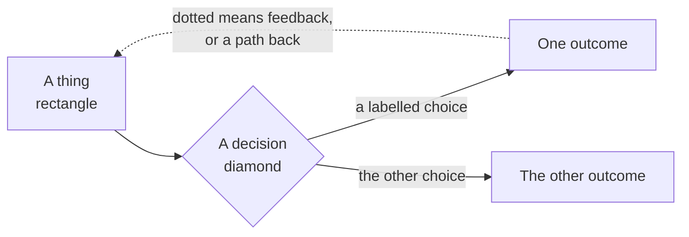

- **Rectangle** — a thing that exists: a file, a repo, a person, a state.
- **Diamond** — a decision or a check. Something evaluates and routes.
- **Solid arrow** — the forward path. What normally happens next.
- **Dotted arrow** — a return: feedback, a loop, a fallback, or a rejection with a reason.
- **Box around a group** — a boundary that matters. Usually a machine or an organization.

**The one thing worth saying out loud:** dotted lines are where the value is. A process with no dotted lines is a conveyor belt, and nobody learns anything on a conveyor belt.

---
---

# Cold open · 0:00

## 2. Where thinking dies

Three destinations, all terminal, and the reason every AI session starts from zero.

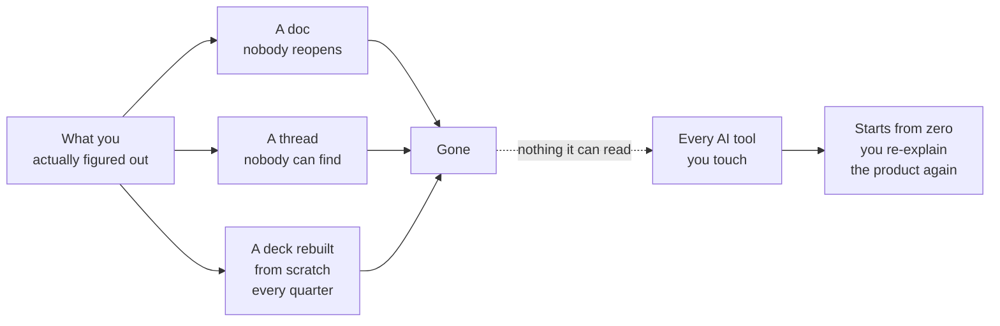

**The line:** nothing you know lives anywhere your tools can find it.

## 3. What GitHub actually is

Four familiar categories stacked, rather than one abstract metaphor. Dean's own framing.

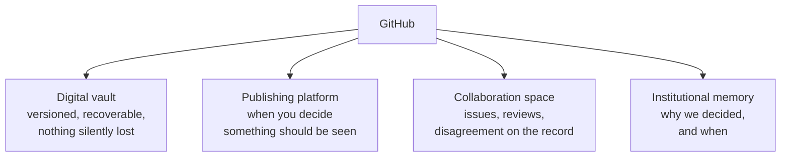

**The straw man to kill first:** search results will tell you it's an alternative to Jira. That's the wrong answer to the wrong question.

---
---

# How git got here · 0:04

## 4. Four steps, none of them planned

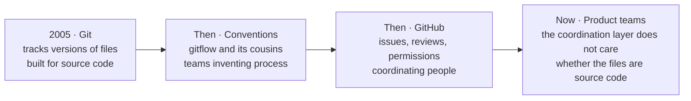

**The handoff line:** every one of those steps was somebody discovering the tool did more than it was built to do. We're just the next ones to notice.


## 5. A branch is a safe place to be wrong

The whole idea, at the only granularity a product audience needs. Work happens off to the side. The main line keeps working the entire time.

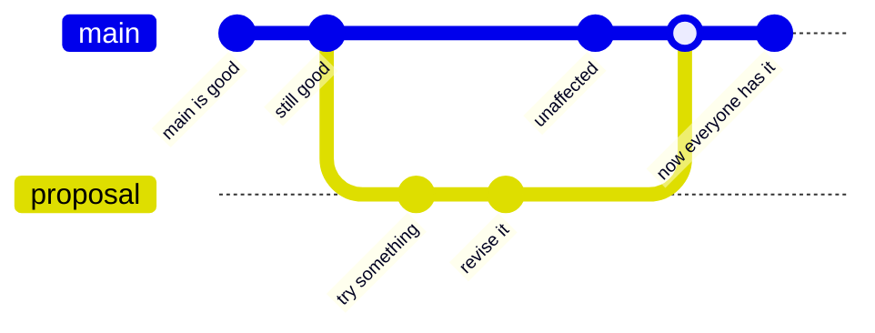

**The two things to point at:** the main line never broke while the work was happening, and nothing became shared until somebody merged it deliberately.

**What not to do here:** do not name the branching models. Gitflow, trunk-based, and the rest are conventions engineering teams argue about, and none of that helps this audience. If someone asks, the answer is "there are named patterns for this, your engineers have opinions, you do not need them today."

## 6. The same shape, in product terms

Why a product manager should care about a mechanic built for source code.

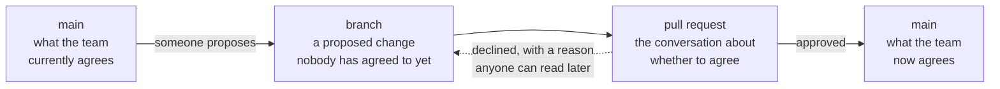

**The line:** a branch is a proposal, a pull request is the argument, and a merge is the moment it becomes what the team believes. That is a product process that happens to be implemented in git.

---
---

# The frame · 0:07

## 7. Two repos, two jobs

The architecture of the whole session. Kenny's work never leaves private.

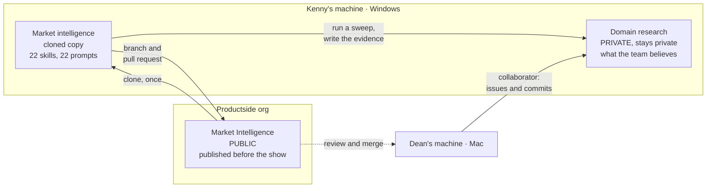

## 8. The tool ladder

Three rungs. The browser is the floor, and every failure recovery drops back to it.

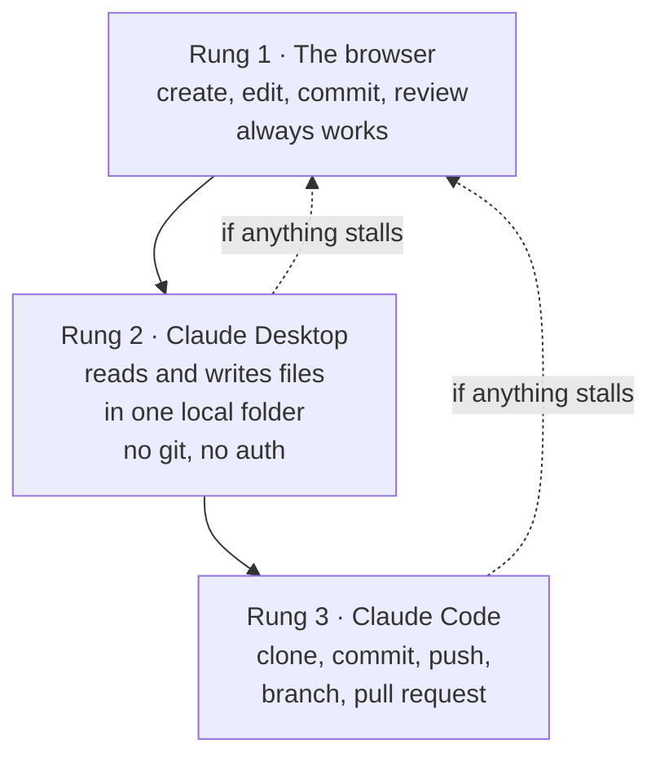

**Kenny never types a git command at any rung.** He says sentences.

---
---

# Play 1 · Context · 0:09

## 9. What goes in the repo

Anatomy of Kenny's domain research Project. Stubs are fine and honest.

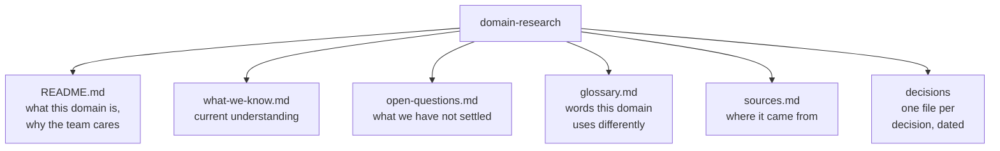

## 10. Three layers, and which one wins

Productside's own repo anatomy — not a GitHub feature. The mechanism is **precedence**.

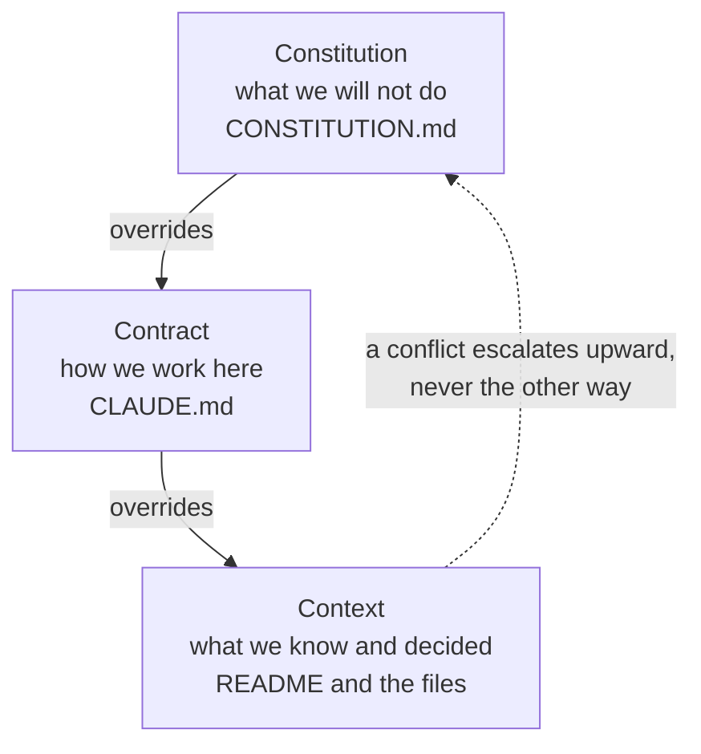

**Three files, three jobs, and the third one wins.** Say it here; call back to it in Play 4.

## 11. The commit history is the strategy timeline

The payoff shot, drawn. Every dot is a dated, attributed, recoverable change.

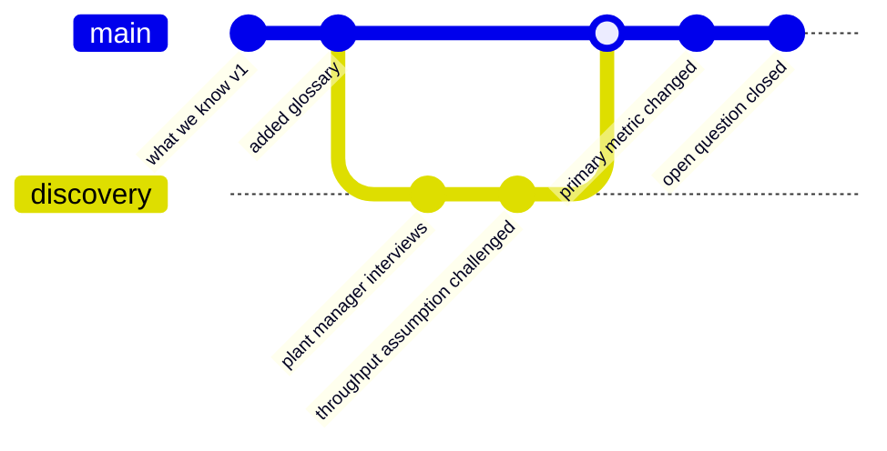

**The line:** no more "ask Dean, he remembers why we changed that."

## 12. A decision record is superseded, never deleted

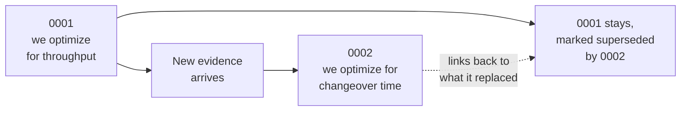

**Why it matters:** you can revert a belief. You cannot revert a market. The record tells you which one you are looking at.

## 13. Session starter, or durable context

The abstract's hardest promise, and the reason this matters to an AI-shaped team.

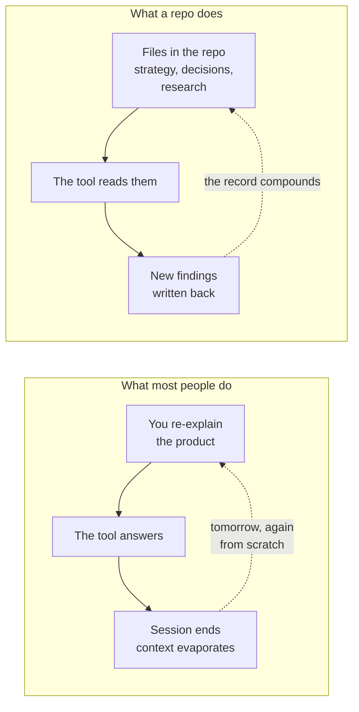

---
---

# Play 2 · Communications · 0:18

## 14. Two machines, one understanding

Windows and macOS, different paths, same repo. The objection this kills: *"I'd need the same setup as my engineers."*

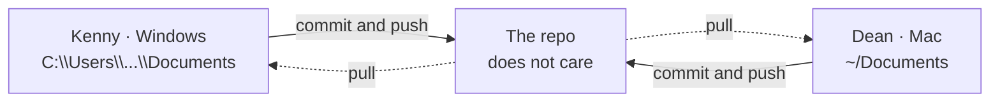

## 15. Should we, or have we decided

The fork most teams have no home for.

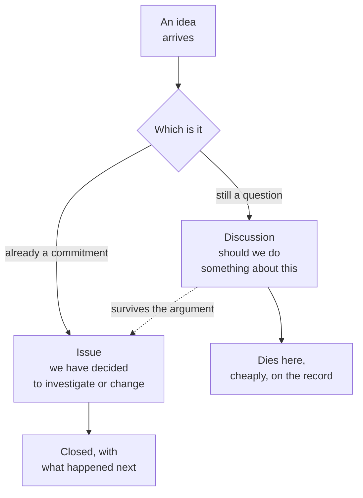

**The line:** arguing in a Discussion costs nothing. Arguing in a roadmap costs a quarter.

## 16. An issue closes with an outcome, not silence

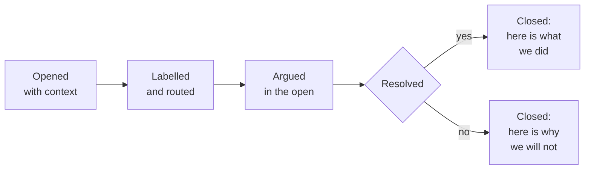

**The part teams skip:** the second box. A declined request with a written reason is a better answer than silence.

---
---

# Play 3 · Confidence · 0:25

## 17. The evidence chain — reuse, do not rebuild

**This diagram already exists** in `Productside-Market-Intelligence-Skills/README.md` — `Instantiate → Collect → Fuse → Act → Monitor`, with a dotted "what changed" edge feeding the next run.

Pull it up from the Project on screen. That the library documents its own method is the point, and showing it live beats reproducing it here.

## 18. Assumption to decision, connected

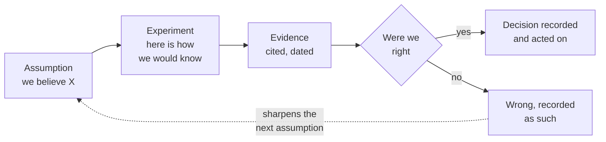

**The one most teams cannot do:** the bottom path. A finding that says *we were wrong* is only valuable if it is findable later.

## 19. Confidence stacks across independent sources

Why six sources can be two disciplines — the trap the library exists to catch.

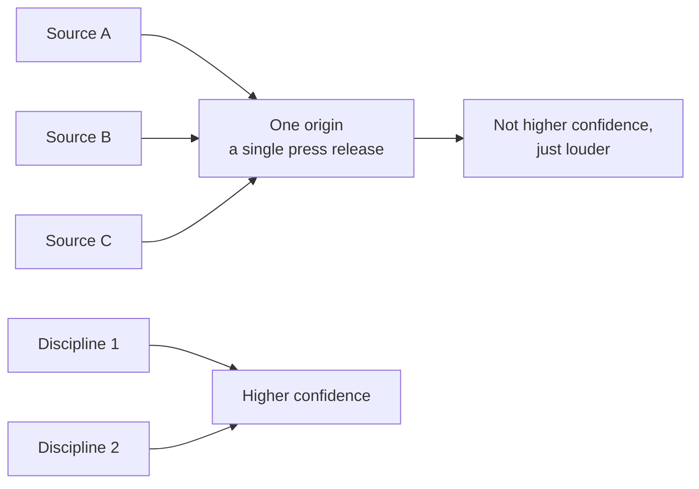

**The line:** stars are not market share, issue volume is not pain severity, commit velocity is not customer value. And beware the squeaky wheel.

---
---

# Play 4 · Constitution · 0:34

## 20. The guard runs before anything lands

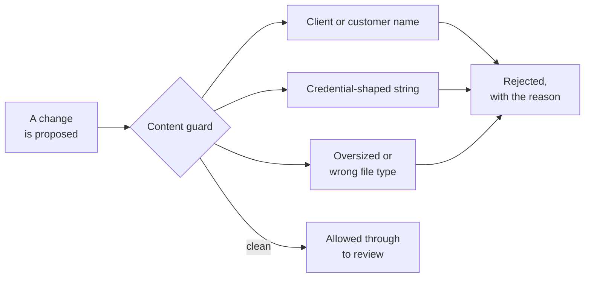

**Dean's shape, verbatim:** the obvious concern is, could we accidentally expose something sensitive? Yes, if we were sloppy. Which is why we are not being sloppy.

## 21. Why the pull request path exists

Branch protection is what makes review real rather than ceremonial.

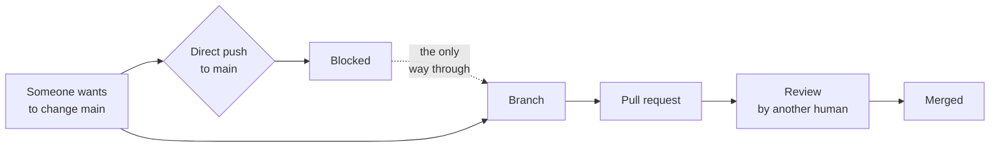

**Without this, the review in Play 5 is theatre** — the contributor could have pushed straight to main.

## 22. Nothing is born public

```mermaid
flowchart LR
  N["New Project"]
  PV["Private<br/>by default"]
  RV{"Publication<br/>review"}
  SC["Scrub, license,<br/>attribution, guard"]
  PB["Public,<br/>deliberately"]

  N --> PV --> RV
  RV -->|"not yet"| PV
  RV -->|"ready"| SC --> PB
```

**The line:** start private. Make it public only when you mean to. Turning something public should feel like a small launch, not a casual settings change.

## 23. Which materials may go public

Productside's own classification. The category decides the answer far more often than the platform does.

```mermaid
flowchart TD
  Q["Something you<br/>want to publish"]
  C1{"Did a client<br/>bring it"}
  C2{"Was it created during<br/>a client engagement"}
  C3{"Are the rights<br/>solely ours"}
  NO1["No · client IP,<br/>never ours to license"]
  NO2["No · vests in the client<br/>as work made for hire"]
  NO3["No · not ours<br/>to grant alone"]
  YES["Yes, after<br/>publication review"]

  Q --> C1
  C1 -->|"yes"| NO1
  C1 -->|"no"| C2
  C2 -->|"yes"| NO2
  C2 -->|"no"| C3
  C3 -->|"no"| NO3
  C3 -->|"yes"| YES
```

**And the rule that governs the gray middle:** material published for public training may be published; bespoke customer material may not. Where something serves both, publish with public in mind and never identify a customer.

---
---

# Play 5 · Community · 0:40

## 24. Install, clone, or fork

Three ways to consume the same library, for three different intents.

```mermaid
flowchart TD
  W{"What do you<br/>want to do"}
  I["Install<br/>two lines,<br/>nothing to manage"]
  C["Clone<br/>a copy you can<br/>read and change"]
  F["Fork<br/>your own copy<br/>on GitHub"]
  U["Just run the skills"]
  CH["Change it and<br/>contribute back"]
  OW["Take it your<br/>own direction"]

  W --> U --> I
  W --> CH --> C
  W --> OW --> F
```

**Kenny clones**, because a pull request needs a branch and a branch needs a clone.

## 25. The contribution loop

The segment Kenny rehearses most.

```mermaid
flowchart LR
  C["Clone<br/>already done<br/>in Play 3"]
  BR["Branch"]
  A["Add the artifact"]
  PU["Commit and push"]
  PR["Open the<br/>pull request"]
  G{"Content guard<br/>runs as a check"}
  RV["Dean reviews<br/>on his Mac"]
  M["Merge to main"]

  C --> BR --> A --> PU --> PR --> G
  G -->|"green"| RV
  G -->|"red"| A
  RV --> M
```

**The red path is not a failure state.** A guard that catches something on camera is worth more than a green tick.

## 26. The participation system

The wider loop the contribution sits inside. Candidate closing visual for the whole show.

```mermaid
flowchart LR
  CV["Conversation<br/>someone has a problem"]
  SB["Structured submission<br/>a template, not a paragraph"]
  AC["Automated check<br/>the guard runs"]
  TR["Triage<br/>labelled and routed"]
  HD["Human decision<br/>yes, no, or not yet"]
  SH["Shipped"]
  RC["Visible record<br/>of what happened next"]

  CV --> SB --> AC --> TR --> HD --> SH --> RC
  RC -.->|"the next person<br/>starts informed"| CV
  HD -.->|"declined, with a reason<br/>anyone can read"| RC
```

**The line:** this is not repository literacy. It is designing a participation system.

**The caveat that goes with it:** to comment or contribute inside a private repo, a person has to be added to it. GitHub does not hand you open participation because you turned on Issues.

---
---

# The spine and the runbook

## 27. The five plays as one story

Not five demos. One person with one problem, five times.

```mermaid
flowchart TD
  P1["Context<br/>Kenny needs a home for<br/>what he is learning"]
  P2["Communications<br/>Dean joins him;<br/>they build it together"]
  P3["Confidence<br/>opinions need evidence,<br/>so he borrows the library"]
  P4["Constitution<br/>some of what he collects<br/>must never leak"]
  P5["Community<br/>he finds a gap<br/>and contributes back"]

  P1 --> P2 --> P3 --> P4 --> P5
  P5 -.->|"the library improves,<br/>the next team starts ahead"| P1
```

## 28. When something breaks on camera

The thirty-second rule. Dean's real job during the build.

```mermaid
flowchart TD
  B["Something<br/>stalls"]
  T{"Thirty<br/>seconds"}
  N["Dean narrates<br/>the hunt out loud"]
  F["Drop to the fallback<br/>browser, or the<br/>rehearsed saved output"]
  S["Say what happened,<br/>and keep going"]

  B --> T
  T -->|"under"| N
  T -->|"over"| F --> S
  N -.->|"still stuck"| F
```

**Never re-run a failed step live.** One attempt, then fallback. Owning it out loud is stronger than hiding it.

## 29. The hour

```mermaid
gantt
  title Run of show
  dateFormat HH:mm
  axisFormat %H:%M
  section Open
  Hold and title         :00:00, 2m
  Cold open              :00:02, 3m
  Housekeeping           :00:05, 3m
  Poll one               :00:08, 2m
  How git got here       :00:10, 2m
  Rules of the show      :00:12, 1m
  section The build
  Context                :00:13, 7m
  Communications         :00:20, 6m
  Confidence             :00:26, 8m
  Constitution           :00:34, 5m
  Community              :00:39, 9m
  section Close
  What GitHub is bad at  :00:48, 2m
  Close                  :00:50, 2m
  Poll two               :00:52, 2m
  Q and A                :00:54, 6m
```

## 30. Kenny's ten days

```mermaid
gantt
  title Prep to September 2
  dateFormat YYYY-MM-DD
  section Kenny solo
  Account and browser      :2026-08-24, 1d
  Windows toolchain        :2026-08-25, 1d
  Rebuild alone            :2026-08-27, 1d
  section Together
  Dry run one, no clock    :2026-08-26, 1d
  Dry run two, recorded    :2026-08-28, 1d
  Tech check               :2026-09-01, 1d
  section Dean solo
  Publish and configure    :2026-08-31, 1d
  section Buffer
  Deliberately empty       :2026-08-29, 2d
  section Show
  Live                     :2026-09-02, 1d
```
