# Diagrams

The visual bench for the webinar companion repo, **organized by capability**. These diagrams are meant to help Product Managers explain, adopt, and adapt GitHub as a product-team workspace.

Every diagram here is Mermaid in Markdown, which GitHub renders natively. Each diagram is text, version-controlled, and reviewable like any other product note.

**This file is the source of truth.** Individual per-diagram files live in [`diagrams/`](diagrams/INDEX.md) and are generated. Edit here, then run `python3 scripts/split-diagrams.py`.

House style: `flowchart` with quoted labels, `<br/>` for line breaks, dotted edges for feedback, no color. Labels should stay short and readable.

---
---

# How to read these

## 1. The notation, once

Every diagram in this set uses the same four marks. Learn them here and they never change.

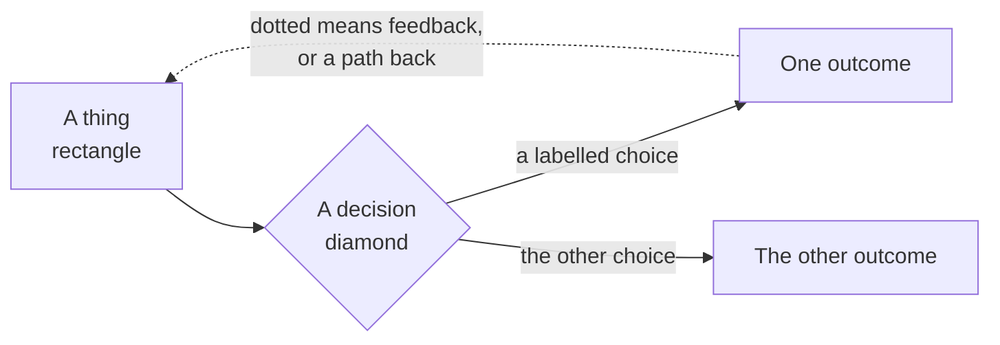

- **Rectangle** — a thing that exists: a file, a repo, a person, a state.
- **Diamond** — a decision or a check. Something evaluates and routes.
- **Solid arrow** — the forward path. What normally happens next.
- **Dotted arrow** — a return: feedback, a loop, a fallback, or a rejection with a reason.
- **Box around a group** — a boundary that matters. Usually a machine or an organization.

**The one thing worth saying out loud:** dotted lines are where the value is. A process with no dotted lines is a conveyor belt, and nobody learns anything on a conveyor belt.

---
---

# The problem and the reframe

## 2. Where thinking dies

Three dead ends, and the reason every AI session starts from zero.

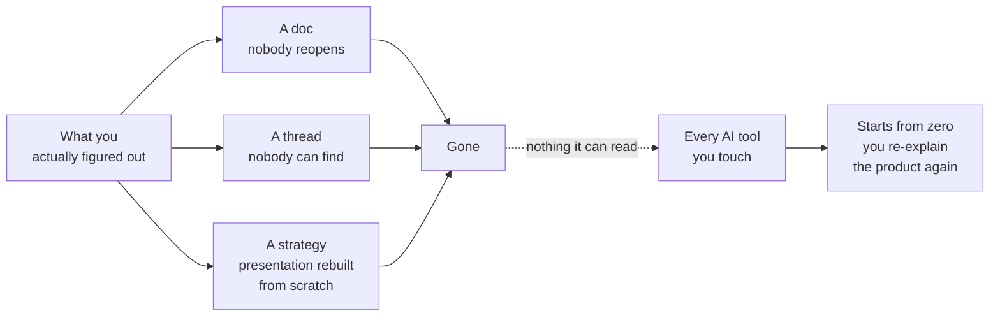

**The line:** nothing you know lives anywhere your tools can find it.

## 3. What GitHub actually is

Four familiar categories stacked, rather than one abstract metaphor.

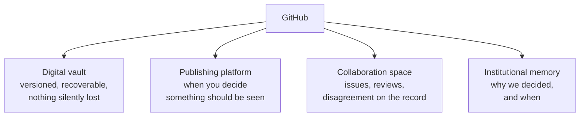

**The mistake to avoid:** search results will tell you GitHub is an alternative to Jira. That's the wrong answer to the wrong question.

## 4. Four steps, none of them planned

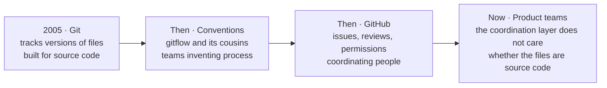

**The useful line:** every one of those steps was somebody discovering the tool did more than it was built to do. We're just the next ones to notice.

---
---

# Capability: Share

## 5. What goes in the repo

Anatomy of a starter product research repository. Stubs are fine and honest.

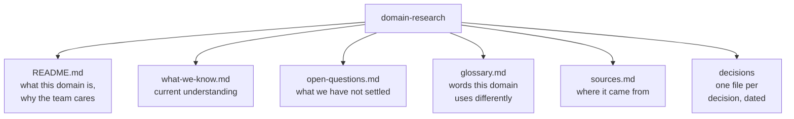

## 6. Three layers, and which one wins

One useful repo anatomy pattern. The mechanism is **precedence**.

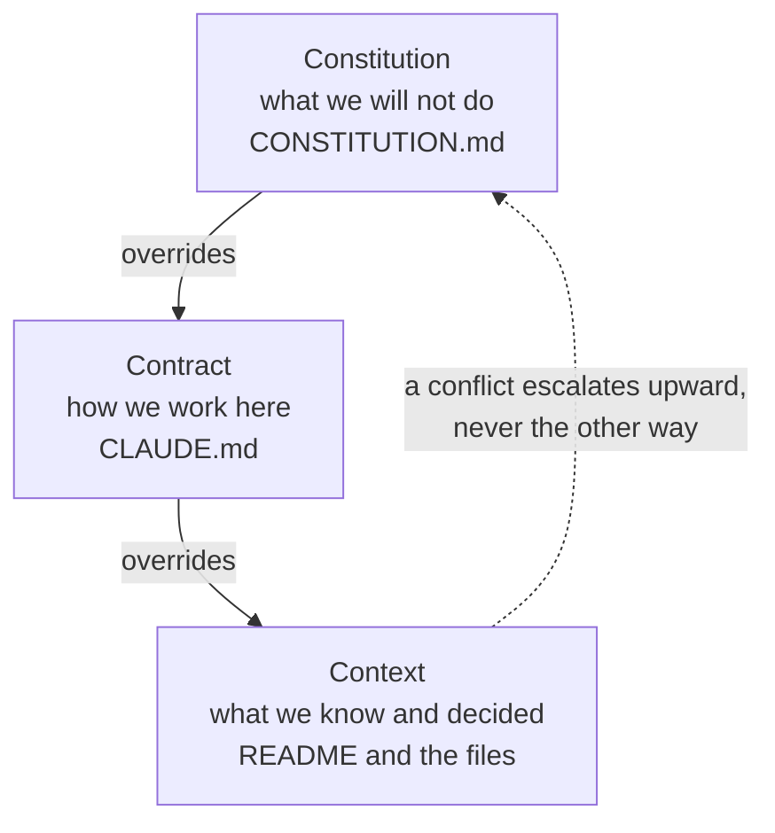

**Three files, three jobs, and the third one wins.**

## 7. Two repos, two jobs

A common workplace pattern: private product context stays private, while reusable team assets can be published after review.

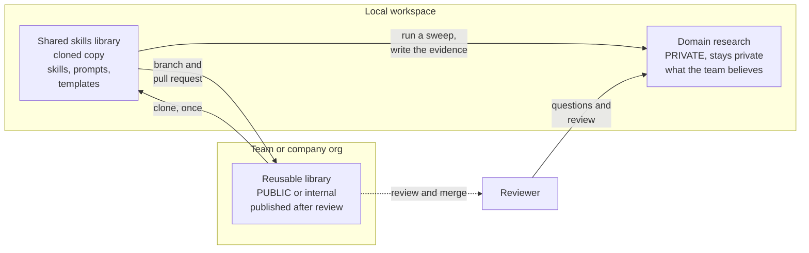

## 8. The tool ladder

Three rungs. The browser is the floor, and every failure recovery drops back to it.

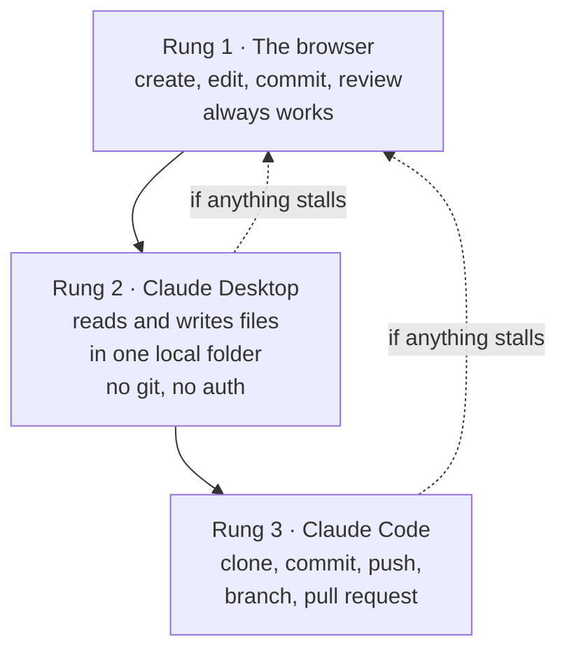

**The adoption idea:** the person using the workflow can ask for outcomes in plain English while the tool handles the mechanics.

---
---

# Capability: Collaborate

## 9. Two machines, one understanding

Different machines, different paths, same repo. The objection this helps with: *"I'd need the same setup as my engineers."*

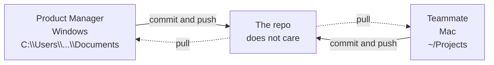

## 10. Should we, or have we decided

The fork most teams have no home for.

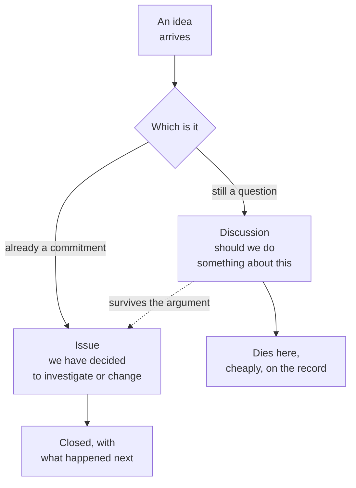

**The line:** arguing in a Discussion costs nothing. Arguing in a roadmap costs a quarter.

## 11. An issue closes with an outcome, not silence

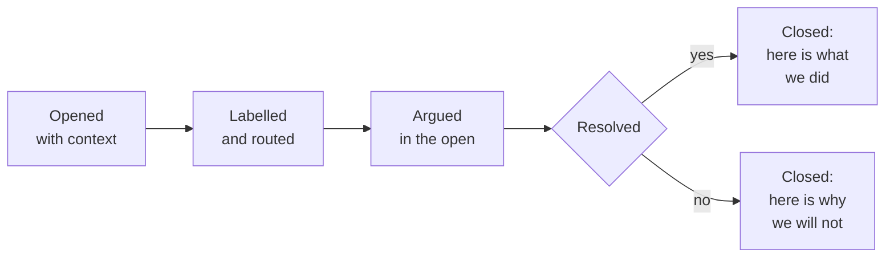

**The part teams skip:** the second box. A declined request with a written reason is a better answer than silence.

---
---

# Capability: Review

## 12. A branch is a safe place to be wrong

The whole idea, at the only granularity a product audience needs. Work happens off to the side. The main line keeps working the entire time.

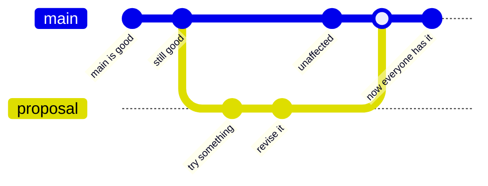

**The two things to point at:** the main line never broke while the work was happening, and nothing became shared until somebody merged it deliberately.

**What not to do here:** do not name the branching models. Gitflow, trunk-based, and the rest are conventions engineering teams argue about, and none of that helps this audience. If someone asks, the answer is "there are named patterns for this, your engineers have opinions, you do not need them today."

## 13. The same shape, in product terms

Why a product manager should care about a mechanic built for source code.

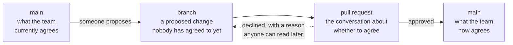

**The line:** a branch is a proposal, a pull request is the argument, and a merge is the moment it becomes what the team believes. That is a product process that happens to be implemented in git.

## 14. Why the pull request path exists

Branch protection is what makes review real rather than ceremonial.

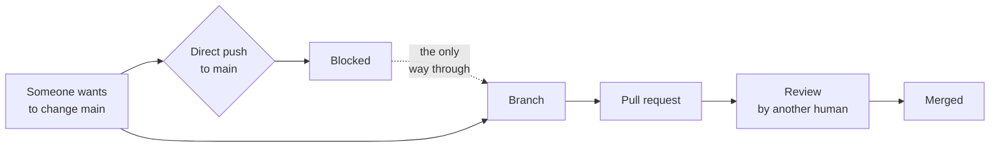

**Without this, the review is theatre** — the contributor could have pushed straight to main.

---
---

# Capability: Trace

## 15. The commit history is the strategy timeline

The payoff shot, drawn. Every dot is a dated, attributed, recoverable change.

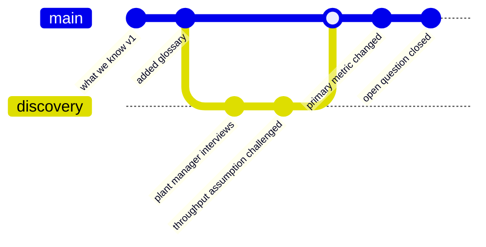

**The line:** no more "ask the one person who remembers why we changed that."

## 16. A decision record is superseded, never deleted

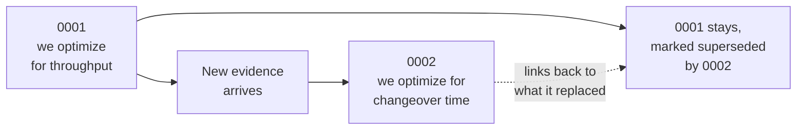

**Why it matters:** you can revert a belief. You cannot revert a market. The record tells you which one you are looking at.

## 17. What changed, who changed it, and why

The workflow-level view: a Product Manager asks a question, the history answers it without a meeting.

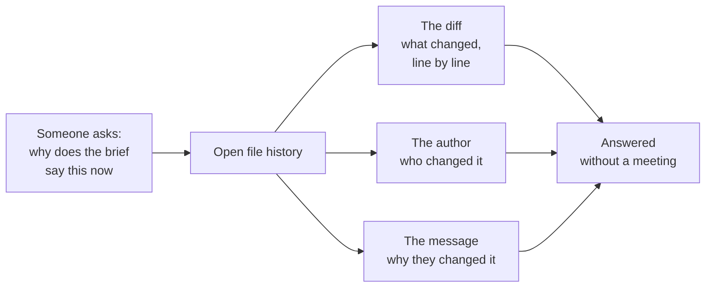

**In plain English:** the trace is only as good as the commit message. "Updated file" tells you nothing. "Added deal-context section after Q1 loss review" tells you everything.

---
---

# Capability: Experiment

## 18. Try a different approach without touching what the team trusts

The Product Manager-facing version: you do not need permission to be wrong, you need a safe place for it.

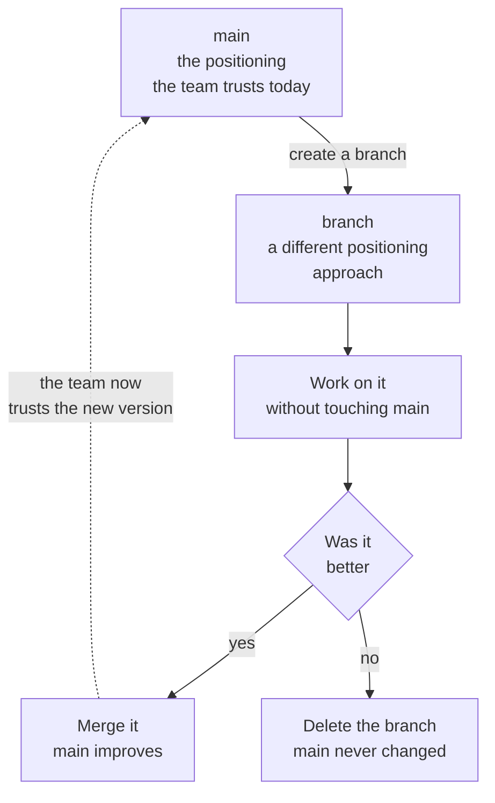

**In plain English:** a branch is a safe place to be wrong. If the experiment fails, delete it. Main never changed.

---
---

# Capability: Augment

## 19. Session starter, or durable context

The abstract's hardest promise, and the reason this matters to an AI-shaped team.

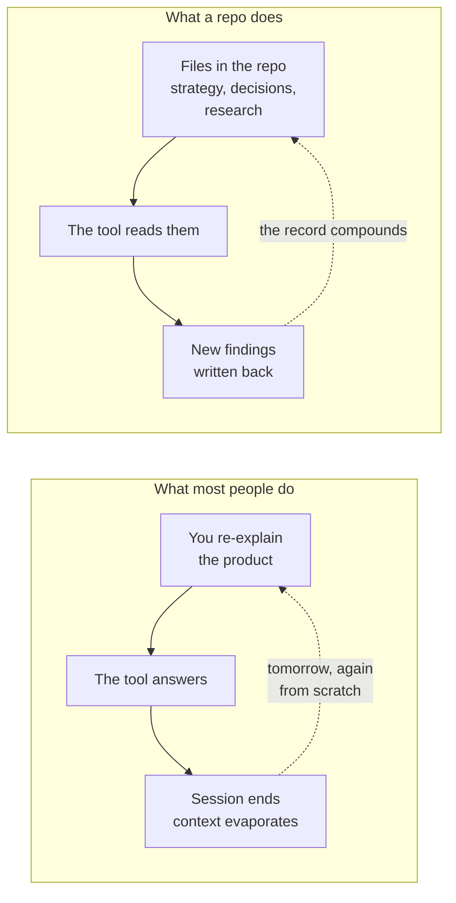

## 20. What the AI reads when it opens the repo

The file-level view: the AI assistant does not start from zero because the context is already there.

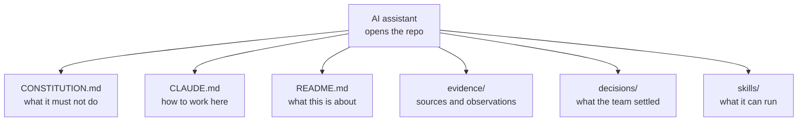

**The line:** the team and its AI work from the same persistent memory. Re-explaining your product every morning is over.

---
---

# Capability: Reuse

## 21. Browse, clone, or fork

Three ways to consume the same library, for three different intents.

```mermaid
flowchart TD
  W{"What do you<br/>want to do"}
  I["Browse<br/>learn without<br/>changing anything"]
  C["Clone<br/>a copy you can<br/>read and change"]
  F["Fork<br/>your own copy<br/>on GitHub"]
  U["Understand<br/>how it works"]
  CH["Change it and<br/>contribute back"]
  OW["Take it your<br/>own direction"]

  W --> U --> I
  W --> CH --> C
  W --> OW --> F
```

**Why browse first:** you can learn the pattern before you touch the machinery.

## 22. The library consumption loop

How a team turns published assets into adopted practice, and how improvements flow back.

```mermaid
flowchart LR
  PB["Published library<br/>skills, templates,<br/>frameworks"]
  CL["Browse or<br/>clone it"]
  RN["Run a skill<br/>on your domain"]
  OP["Structured output<br/>cited, formatted"]
  WR["Written into<br/>your repo"]
  FG["Find a gap<br/>or an improvement"]
  PR["Contribute back<br/>via pull request"]

  PB --> CL --> RN --> OP --> WR
  WR -.->|"over time"| FG --> PR
  PR -.->|"merged: the library<br/>improves for everyone"| PB
```

**In plain English:** tribal knowledge becomes team infrastructure. The next person who runs that skill gets your improvements automatically.

## 23. The contribution loop

The reusable contribution path.

```mermaid
flowchart LR
  C["Clone<br/>already done"]
  BR["Branch"]
  A["Add the artifact"]
  PU["Commit and push"]
  PR["Open the<br/>pull request"]
  G{"Content guard<br/>runs as a check"}
  RV["A teammate reviews"]
  M["Merge to main"]

  C --> BR --> A --> PU --> PR --> G
  G -->|"green"| RV
  G -->|"red"| A
  RV --> M
```

**The red path is not a failure state.** A guard that catches something early is worth more than a false green check.

## 24. The participation system

The wider loop the contribution sits inside.

```mermaid
flowchart LR
  CV["Conversation<br/>someone has a problem"]
  SB["Structured submission<br/>a template, not a paragraph"]
  AC["Automated check<br/>the guard runs"]
  TR["Triage<br/>labelled and routed"]
  HD["Human decision<br/>yes, no, or not yet"]
  SH["Shipped"]
  RC["Visible record<br/>of what happened next"]

  CV --> SB --> AC --> TR --> HD --> SH --> RC
  RC -.->|"the next person<br/>starts informed"| CV
  HD -.->|"declined, with a reason<br/>anyone can read"| RC
```

**The line:** this is not repository literacy. It is designing a participation system.

**The caveat that goes with it:** to comment or contribute inside a private repo, a person has to be added to it. GitHub does not hand you open participation because you turned on Issues.

---
---

# Capability: Catchup

## 25. Pull latest and see what moved

The workflow a Product Manager runs every morning: what changed since I was last here, and why.

```mermaid
flowchart LR
  PM["Product Manager<br/>opens the repo"]
  PL["Pull latest<br/>from main"]
  DF["See the diff<br/>what changed overnight"]
  CM["Read commit messages<br/>who changed it and why"]
  IS["Check issues<br/>new questions or decisions"]
  PR["Check pull requests<br/>pending reviews"]
  OR["Oriented<br/>without a standup"]

  PM --> PL --> DF --> CM --> OR
  PM --> IS --> OR
  PM --> PR --> OR
```

**In plain English:** the standup you do not have to schedule. The repo is the standup.

---
---

# Guardrails and governance

## 26. The guard runs before anything lands

```mermaid
flowchart LR
  C["A change<br/>is proposed"]
  G{"Content guard"}
  B1["Client or customer name"]
  B2["Credential-shaped string"]
  B3["Oversized or<br/>wrong file type"]
  R["Rejected,<br/>with the reason"]
  P["Allowed through<br/>to review"]

  C --> G
  G --> B1 --> R
  G --> B2 --> R
  G --> B3 --> R
  G -->|"clean"| P
```

**The useful shape:** the obvious concern is, could we accidentally expose something sensitive? Yes, if we were sloppy. Which is why we are not being sloppy.

## 27. Nothing is born public

```mermaid
flowchart LR
  N["New Project"]
  PV["Private<br/>by default"]
  RV{"Review"}
  SC["Review, license,<br/>attribution, guard"]
  PB["Public,<br/>deliberately"]

  N --> PV --> RV
  RV -->|"not yet"| PV
  RV -->|"ready"| SC --> PB
```

**The line:** start private. Share deliberately. Public work deserves review, not vibes.

## 28. Which materials may go public

Productside's own classification. The category decides the answer far more often than the platform does.

```mermaid
flowchart TD
  Q["Something you<br/>want to publish"]
  C1{"Did a client<br/>bring it"}
  C2{"Was it created during<br/>a client engagement"}
  C3{"Are the rights<br/>solely ours"}
  NO1["No · client IP,<br/>never ours to license"]
  NO2["No · vests in the client<br/>as work made for hire"]
  NO3["No · not ours<br/>to grant alone"]
  YES["Yes, after<br/>publication review"]

  Q --> C1
  C1 -->|"yes"| NO1
  C1 -->|"no"| C2
  C2 -->|"yes"| NO2
  C2 -->|"no"| C3
  C3 -->|"no"| NO3
  C3 -->|"yes"| YES
```

**And the rule that governs the gray middle:** material published for public training may be published; bespoke customer material may not. Where something serves both, publish with public in mind and never identify a customer.

## 29. The evidence chain — reuse, do not rebuild

Use a reusable evidence chain when a team repeats the same product-learning workflow across markets, customers, competitors, or releases.

The useful pattern is: instantiate the workflow, collect evidence, fuse what was found, act on the result, monitor what changes, then feed those changes into the next run.

## 30. Assumption to decision, connected

```mermaid
flowchart LR
  AS["Assumption<br/>we believe X"]
  EX["Experiment<br/>here is how<br/>we would know"]
  EV["Evidence<br/>cited, dated"]
  DE{"Were we<br/>right"}
  KE["Decision recorded<br/>and acted on"]
  WR["Wrong, recorded<br/>as such"]

  AS --> EX --> EV --> DE
  DE -->|"yes"| KE
  DE -->|"no"| WR
  WR -.->|"sharpens the<br/>next assumption"| AS
```

**The one most teams cannot do:** the bottom path. A finding that says *we were wrong* is only valuable if it is findable later.

## 31. Confidence stacks across independent sources

Why six sources can be two disciplines — the trap the library exists to catch.

```mermaid
flowchart LR
  S1["Source A"]
  S2["Source B"]
  S3["Source C"]
  O["One origin<br/>a single press release"]
  I1["Discipline 1"]
  I2["Discipline 2"]
  H["Higher confidence"]
  L["Not higher confidence,<br/>just louder"]

  S1 --> O
  S2 --> O
  S3 --> O
  O --> L
  I1 --> H
  I2 --> H
```

**The line:** stars are not market share, issue volume is not pain severity, commit velocity is not customer value. And beware the squeaky wheel.

---
---

# The complete model

## 32. The seven capabilities as one story

Not seven demos. One team's thinking, compounding across seven capabilities.

```mermaid
flowchart TD
  S["Share<br/>a home for what<br/>the team knows"]
  CO["Collaborate<br/>work together without<br/>trampling each other"]
  RV["Review<br/>changes are reviewable<br/>before they become truth"]
  TR["Trace<br/>what changed,<br/>who, and why"]
  EX["Experiment<br/>explore without breaking<br/>what works"]
  AU["Augment<br/>AI reads the same<br/>context as the team"]
  RE["Reuse<br/>practices become assets<br/>another team can adopt"]

  S --> CO --> RV --> TR --> EX --> AU --> RE
  RE -.->|"the library improves,<br/>the next team starts ahead"| S
```
