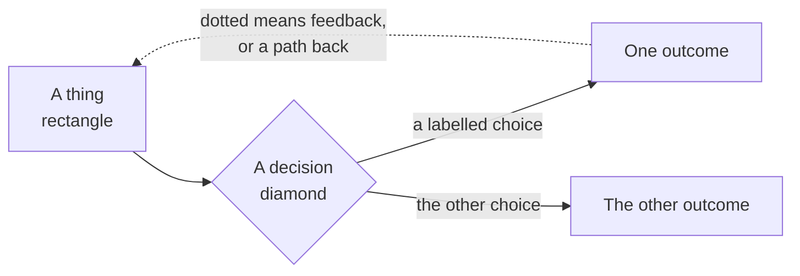

# The notation, once

**How to read these**

Every diagram in this set uses the same four marks. Learn them here and they never change.

- **Rectangle** — a thing that exists: a file, a repo, a person, a state.
- **Diamond** — a decision or a check. Something evaluates and routes.
- **Solid arrow** — the forward path. What normally happens next.
- **Dotted arrow** — a return: feedback, a loop, a fallback, or a rejection with a reason.
- **Box around a group** — a boundary that matters. Usually a machine or an organization.

**The one thing worth saying out loud:** dotted lines are where the value is. A process with no dotted lines is a conveyor belt, and nobody learns anything on a conveyor belt.

---

---

[All diagrams](INDEX.md) · [Diagram source](../diagrams.md)
