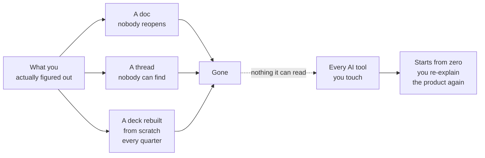

# Where thinking dies

**The problem and the reframe**

Three destinations, all terminal, and the reason every AI session starts from zero.

**The line:** nothing you know lives anywhere your tools can find it.

---

[All diagrams](INDEX.md) · [Runbook reading order](../diagrams.md)
