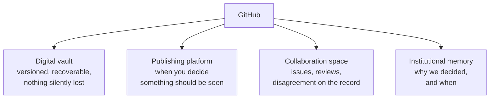

# What GitHub actually is

**The problem and the reframe**

Four familiar categories stacked, rather than one abstract metaphor. Dean's own framing.

**The straw man to kill first:** search results will tell you it's an alternative to Jira. That's the wrong answer to the wrong question.

---

[All diagrams](INDEX.md) · [Runbook reading order](../diagrams.md)
