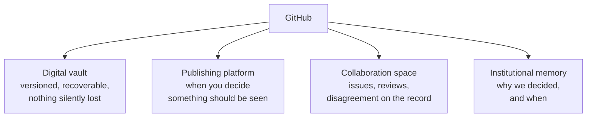

# What GitHub actually is

**The problem and the reframe**

Four familiar categories stacked, rather than one abstract metaphor.

**The mistake to avoid:** search results will tell you GitHub is an alternative to Jira. That's the wrong answer to the wrong question.

---

[All diagrams](INDEX.md) · [Diagram source](../diagrams.md)
