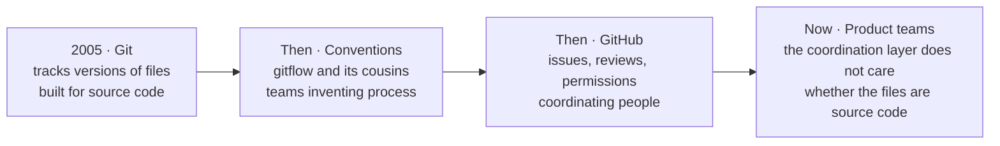

# Four steps, none of them planned

**How git got here · 0:04**

**The handoff line:** every one of those steps was somebody discovering the tool did more than it was built to do. We're just the next ones to notice.

---

[All diagrams](INDEX.md) · [Runbook reading order](../diagrams.md)
