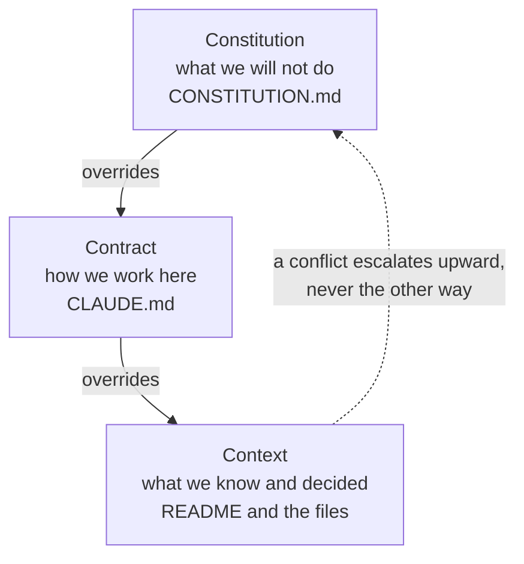

# Three layers, and which one wins

**Capability: Share**

One useful repo anatomy pattern. The mechanism is **precedence**.

**Three files, three jobs, and the third one wins.**

---

[All diagrams](INDEX.md) · [Diagram source](../diagrams.md)
