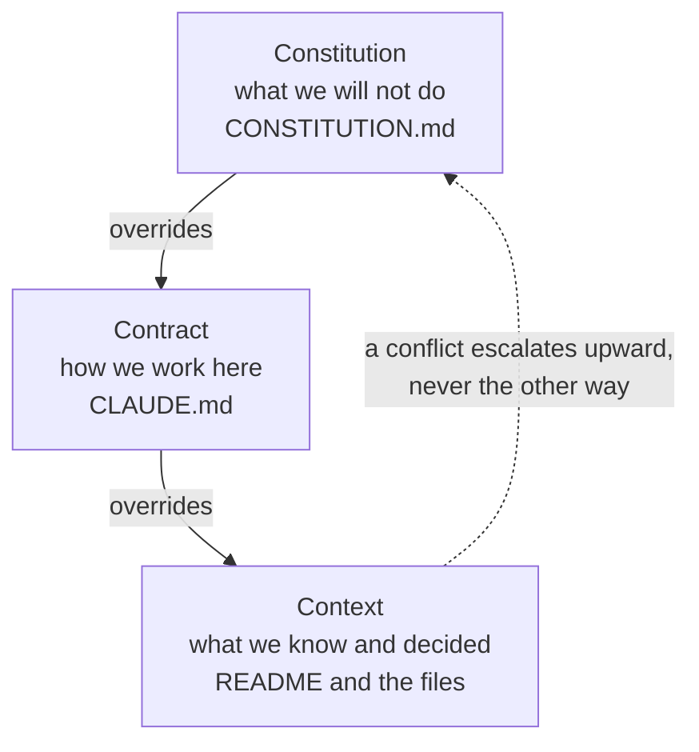

# Three layers, and which one wins

**Capability: Share**

Productside's own repo anatomy — not a GitHub feature. The mechanism is **precedence**.

**Three files, three jobs, and the third one wins.** Say it here; call back to it in the Constitution capability.

---

[All diagrams](INDEX.md) · [Runbook reading order](../diagrams.md)
