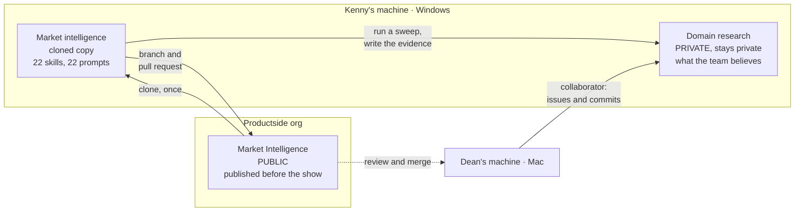

# Two repos, two jobs

**The frame · 0:07**

The architecture of the whole session. Kenny's work never leaves private.

```mermaid
flowchart LR
  subgraph K["Kenny's machine · Windows"]
    KR["Domain research<br/>PRIVATE, stays private<br/>what the team believes"]
    ML["Market intelligence<br/>cloned copy<br/>22 skills, 22 prompts"]
  end
  subgraph P["Productside org"]
    MI["Market Intelligence<br/>PUBLIC<br/>published before the show"]
  end
  D["Dean's machine · Mac"]

  MI -->|"clone, once"| ML
  ML -->|"run a sweep,<br/>write the evidence"| KR
  D -->|"collaborator:<br/>issues and commits"| KR
  ML -->|"branch and<br/>pull request"| MI
  MI -.->|"review and merge"| D
```

---

[All diagrams](INDEX.md) · [Runbook reading order](../diagrams.md)
