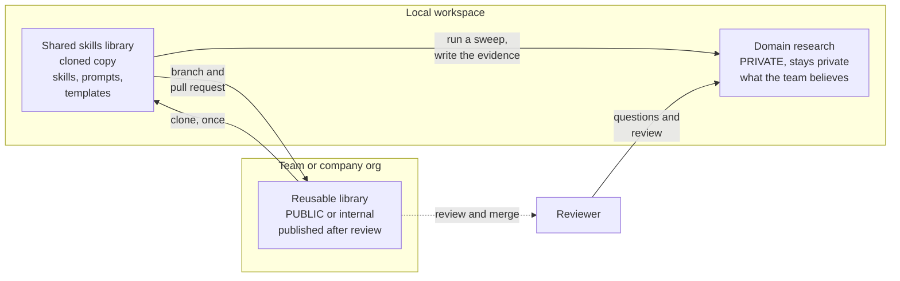

# Two repos, two jobs

**Capability: Share**

A common workplace pattern: private product context stays private, while reusable team assets can be published after review.

---

[All diagrams](INDEX.md) · [Diagram source](../diagrams.md)
