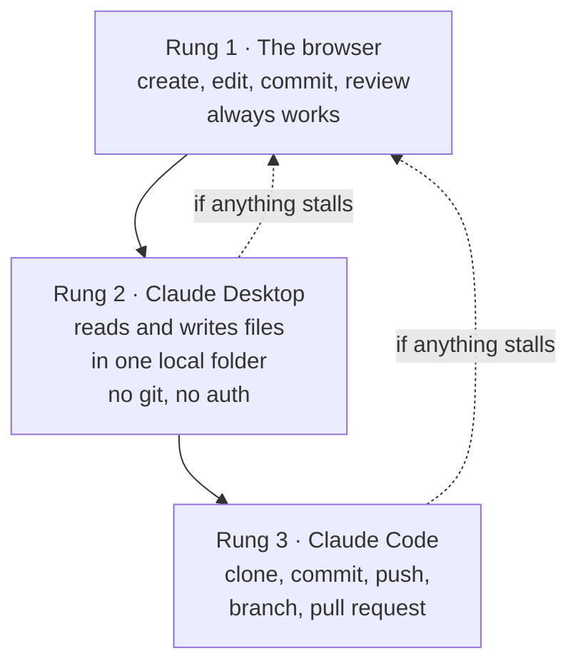

# The tool ladder

**Capability: Share**

Three rungs. The browser is the floor, and every failure recovery drops back to it.

**The adoption idea:** the person using the workflow can ask for outcomes in plain English while the tool handles the mechanics.

---

---

[All diagrams](INDEX.md) · [Diagram source](../diagrams.md)
