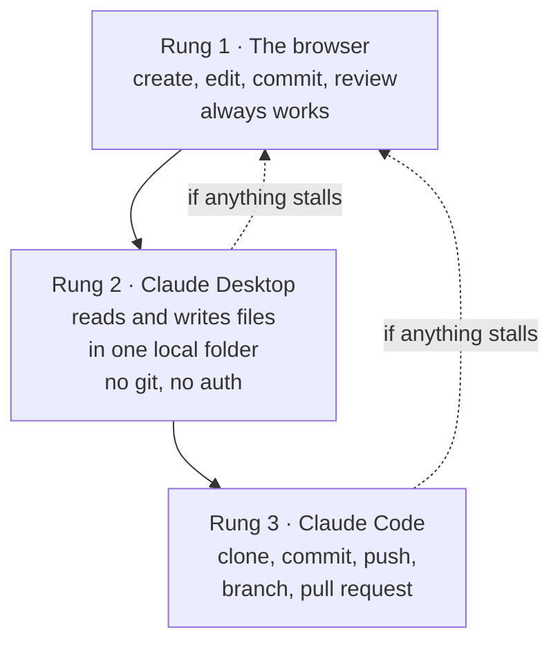

# The tool ladder

**Capability: Share**

Three rungs. The browser is the floor, and every failure recovery drops back to it.

**Kenny never types a git command at any rung.** He says sentences.

---

---

[All diagrams](INDEX.md) · [Runbook reading order](../diagrams.md)
