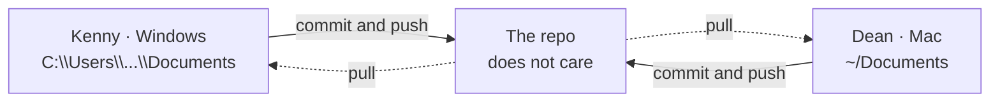

# Two machines, one understanding

**Capability: Collaborate**

Windows and macOS, different paths, same repo. The objection this kills: *"I'd need the same setup as my engineers."*

---

[All diagrams](INDEX.md) · [Runbook reading order](../diagrams.md)
