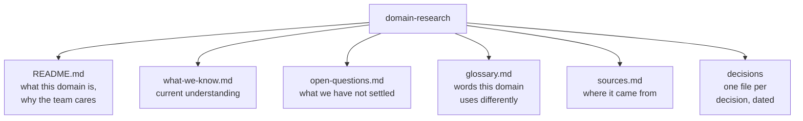

# What goes in the repo

**Play 1 · Context · 0:09**

Anatomy of Kenny's domain research Project. Stubs are fine and honest.

---

[All diagrams](INDEX.md) · [Runbook reading order](../diagrams.md)
