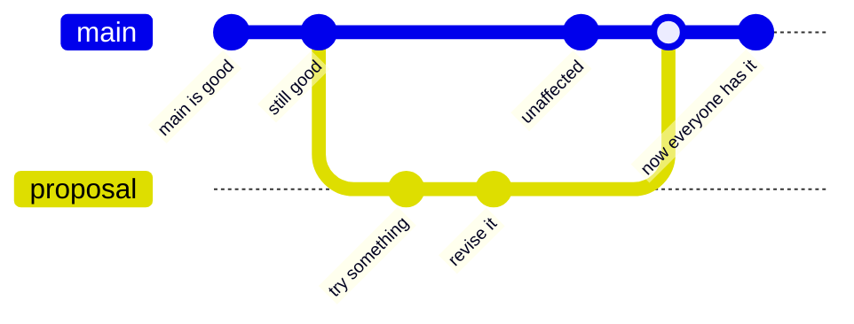

# A branch is a safe place to be wrong

**Capability: Review**

The whole idea, at the only granularity a product audience needs. Work happens off to the side. The main line keeps working the entire time.

**The two things to point at:** the main line never broke while the work was happening, and nothing became shared until somebody merged it deliberately.

**What not to do here:** do not name the branching models. Gitflow, trunk-based, and the rest are conventions engineering teams argue about, and none of that helps this audience. If someone asks, the answer is "there are named patterns for this, your engineers have opinions, you do not need them today."

---

[All diagrams](INDEX.md) · [Runbook reading order](../diagrams.md)
