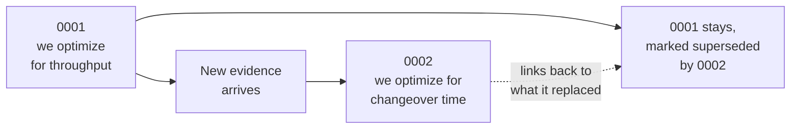

# A decision record is superseded, never deleted

**Play 1 · Context · 0:09**

**Why it matters:** you can revert a belief. You cannot revert a market. The record tells you which one you are looking at.

---

[All diagrams](INDEX.md) · [Runbook reading order](../diagrams.md)
