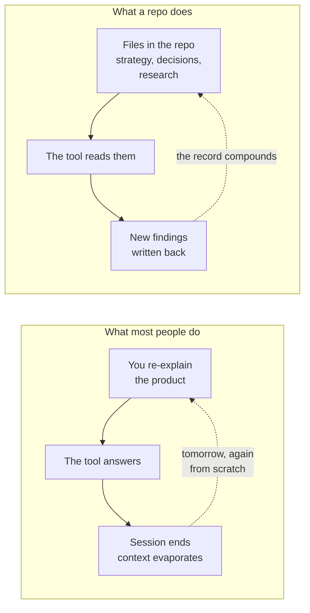

# Session starter, or durable context

**Play 1 · Context · 0:09**

The abstract's hardest promise, and the reason this matters to an AI-shaped team.

---

---

[All diagrams](INDEX.md) · [Runbook reading order](../diagrams.md)
