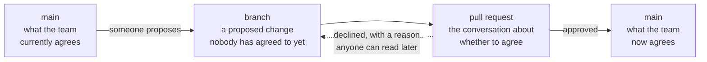

# The same shape, in product terms

**Capability: Review**

Why a product manager should care about a mechanic built for source code.

**The line:** a branch is a proposal, a pull request is the argument, and a merge is the moment it becomes what the team believes. That is a product process that happens to be implemented in git.

---

[All diagrams](INDEX.md) · [Diagram source](../diagrams.md)
