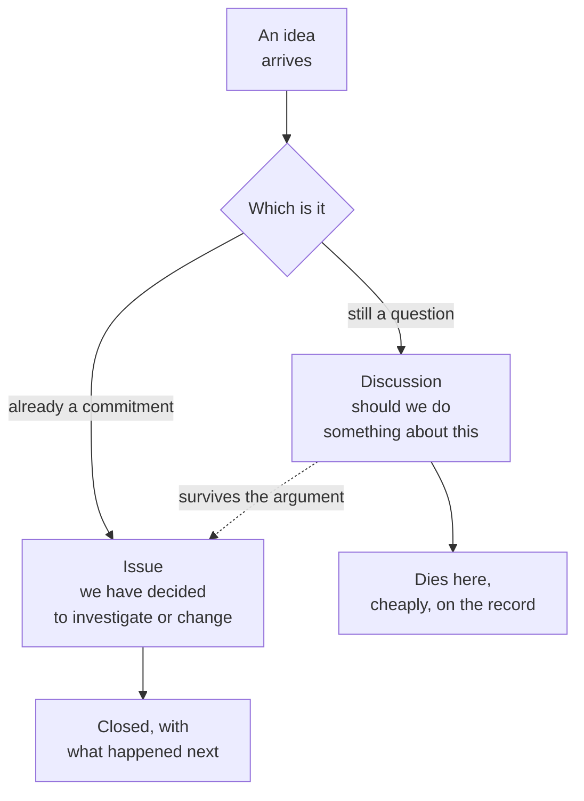

# Should we, or have we decided

**Play 2 · Communications · 0:18**

The fork most teams have no home for.

**The line:** arguing in a Discussion costs nothing. Arguing in a roadmap costs a quarter.

---

[All diagrams](INDEX.md) · [Runbook reading order](../diagrams.md)
