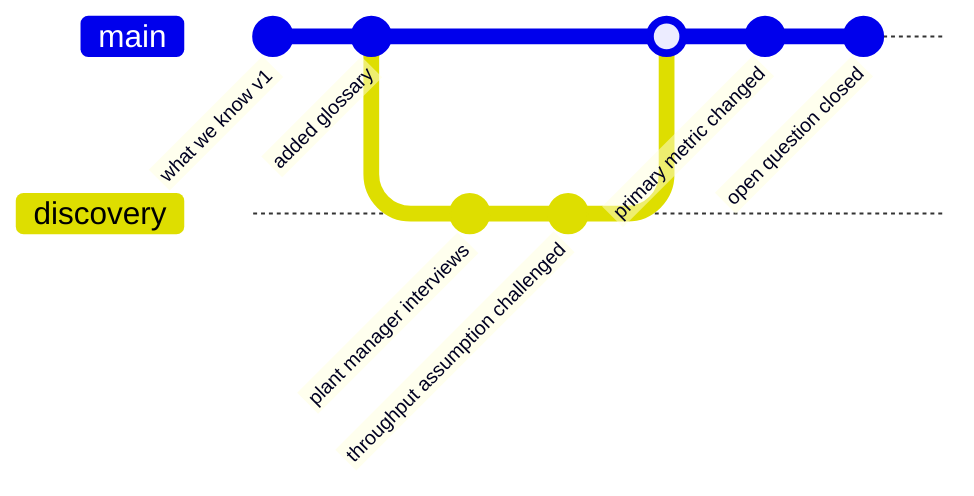

# The commit history is the strategy timeline

**Capability: Trace**

The payoff shot, drawn. Every dot is a dated, attributed, recoverable change.

**The line:** no more "ask Dean, he remembers why we changed that."

---

[All diagrams](INDEX.md) · [Runbook reading order](../diagrams.md)
