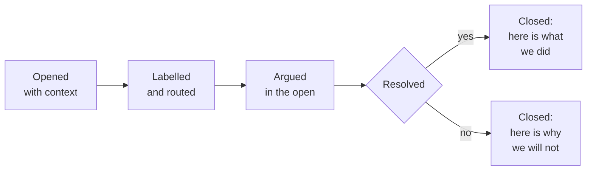

# An issue closes with an outcome, not silence

**Play 2 · Communications · 0:18**

**The part teams skip:** the second box. A declined request with a written reason is a better answer than silence.

---

---

[All diagrams](INDEX.md) · [Runbook reading order](../diagrams.md)
