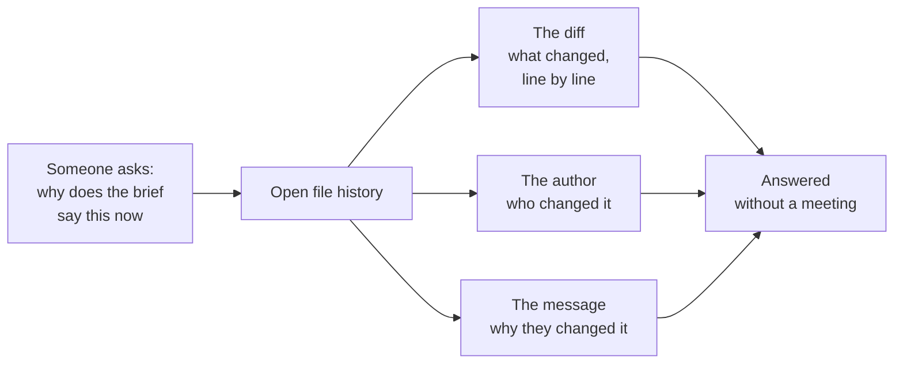

# What changed, who changed it, and why

**Capability: Trace**

The workflow-level view: a Product Manager asks a question, the history answers it without a meeting.

**In plain English:** the trace is only as good as the commit message. "Updated file" tells you nothing. "Added deal-context section after Q1 loss review" tells you everything.

---

---

[All diagrams](INDEX.md) · [Diagram source](../diagrams.md)
