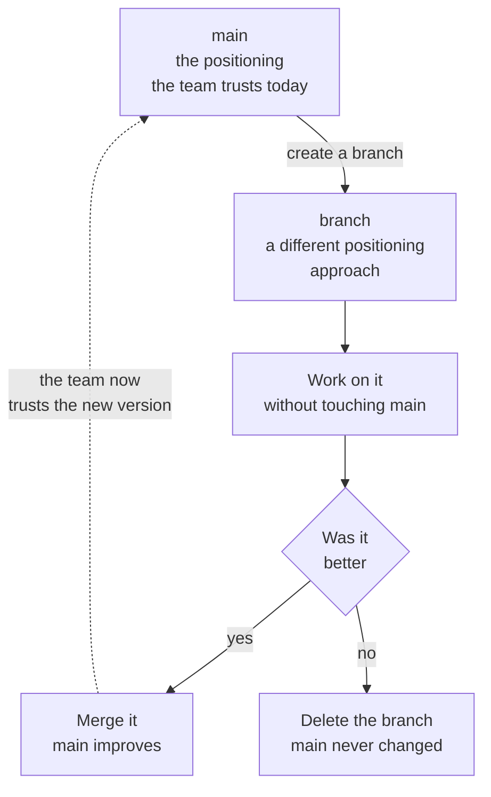

# Try a different approach without touching what the team trusts

**Capability: Experiment**

The PM-facing version: you do not need permission to be wrong, you need a safe place for it.

**In plain English:** a branch is a safe place to be wrong. If the experiment fails, delete it. Main never changed.

---

---

[All diagrams](INDEX.md) · [Runbook reading order](../diagrams.md)
