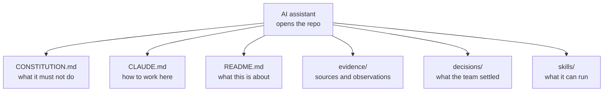

# What the AI reads when it opens the repo

**Capability: Augment**

The file-level view: the AI assistant does not start from zero because the context is already there.

**The line:** the team and its AI work from the same persistent memory. Re-explaining your product every morning is over.

---

---

[All diagrams](INDEX.md) · [Diagram source](../diagrams.md)
