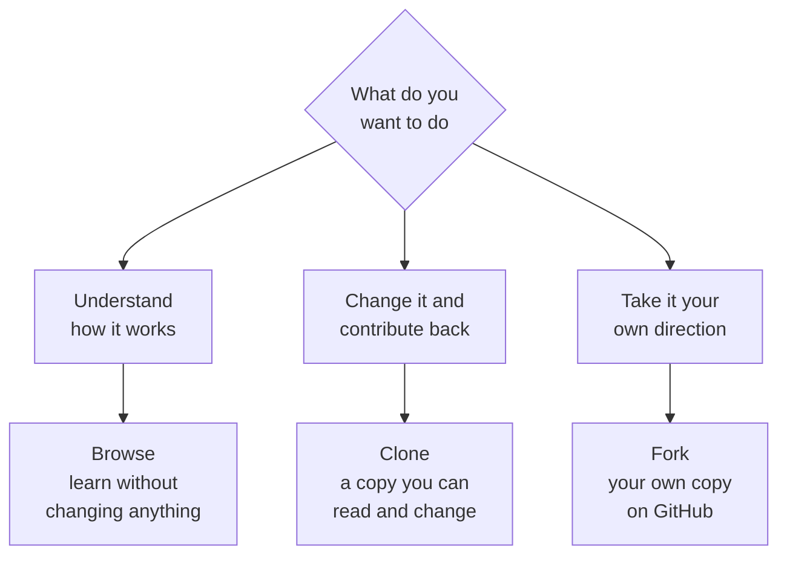

# Browse, clone, or fork

**Capability: Reuse**

Three ways to consume the same library, for three different intents.

**Why browse first:** you can learn the pattern before you touch the machinery.

---

[All diagrams](INDEX.md) · [Diagram source](../diagrams.md)
