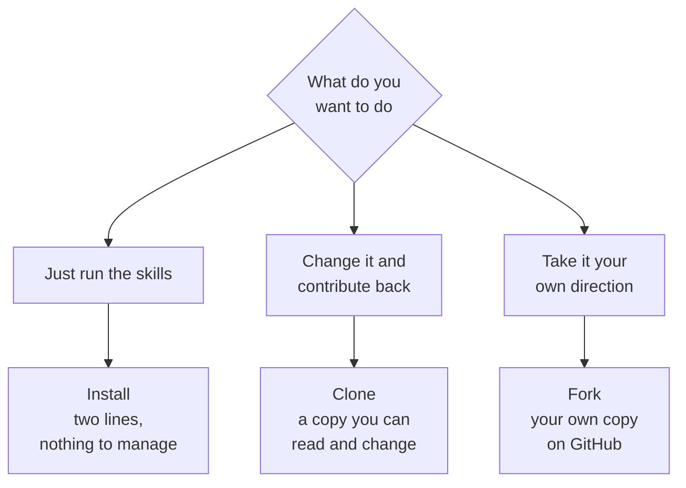

# Install, clone, or fork

**Capability: Reuse**

Three ways to consume the same library, for three different intents.

**Kenny clones**, because a pull request needs a branch and a branch needs a clone.

---

[All diagrams](INDEX.md) · [Runbook reading order](../diagrams.md)
