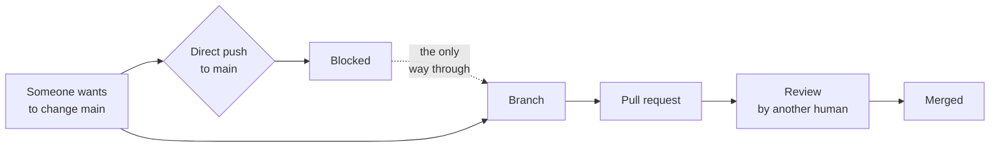

# Why the pull request path exists

**Play 4 · Constitution · 0:34**

Branch protection is what makes review real rather than ceremonial.

**Without this, the review in Play 5 is theatre** — the contributor could have pushed straight to main.

---

[All diagrams](INDEX.md) · [Runbook reading order](../diagrams.md)
