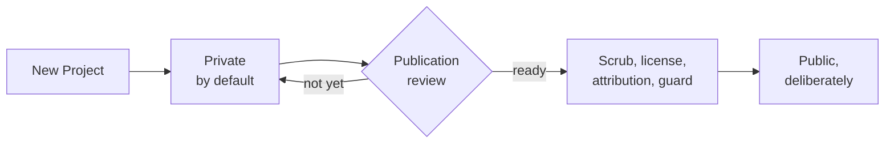

# Nothing is born public

**Play 4 · Constitution · 0:34**

**The line:** start private. Make it public only when you mean to. Turning something public should feel like a small launch, not a casual settings change.

---

[All diagrams](INDEX.md) · [Runbook reading order](../diagrams.md)
