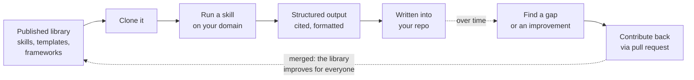

# The library consumption loop

**Capability: Reuse**

How a team turns published assets into adopted practice, and how improvements flow back.

**In plain English:** tribal knowledge becomes team infrastructure. The next person who runs that skill gets your improvements automatically.

---

[All diagrams](INDEX.md) · [Runbook reading order](../diagrams.md)
