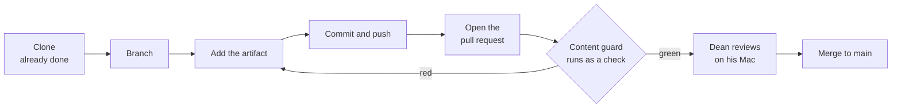

# The contribution loop

**Capability: Reuse**

The segment Kenny rehearses most.

**The red path is not a failure state.** A guard that catches something on camera is worth more than a green tick.

---

[All diagrams](INDEX.md) · [Runbook reading order](../diagrams.md)
