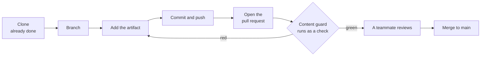

# The contribution loop

**Capability: Reuse**

The reusable contribution path.

**The red path is not a failure state.** A guard that catches something early is worth more than a false green check.

---

[All diagrams](INDEX.md) · [Diagram source](../diagrams.md)
