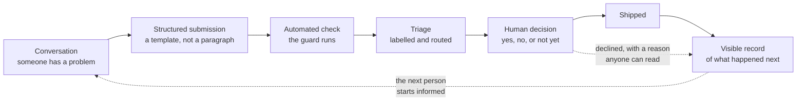

# The participation system

**Capability: Reuse**

The wider loop the contribution sits inside. Candidate closing visual for the whole show.

**The line:** this is not repository literacy. It is designing a participation system.

**The caveat that goes with it:** to comment or contribute inside a private repo, a person has to be added to it. GitHub does not hand you open participation because you turned on Issues.

---

---

[All diagrams](INDEX.md) · [Runbook reading order](../diagrams.md)
