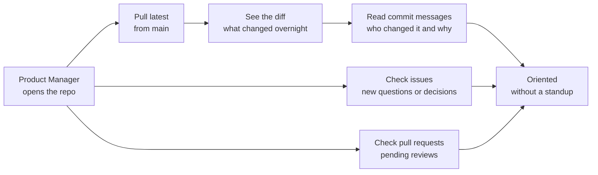

# Pull latest and see what moved

**Capability: Catchup**

The workflow a Product Manager runs every morning: what changed since I was last here, and why.

**In plain English:** the standup you do not have to schedule. The repo is the standup.

---

---

[All diagrams](INDEX.md) · [Diagram source](../diagrams.md)
