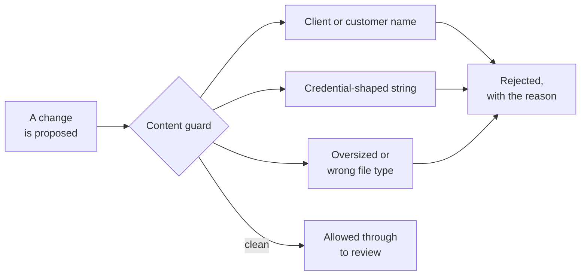

# The guard runs before anything lands

**Guardrails and governance**

**Dean's shape, verbatim:** the obvious concern is, could we accidentally expose something sensitive? Yes, if we were sloppy. Which is why we are not being sloppy.

---

[All diagrams](INDEX.md) · [Runbook reading order](../diagrams.md)
