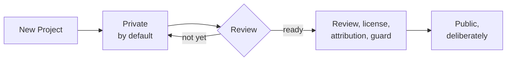

# Nothing is born public

**Guardrails and governance**

**The line:** start private. Share deliberately. Public work deserves review, not vibes.

---

[All diagrams](INDEX.md) · [Diagram source](../diagrams.md)
