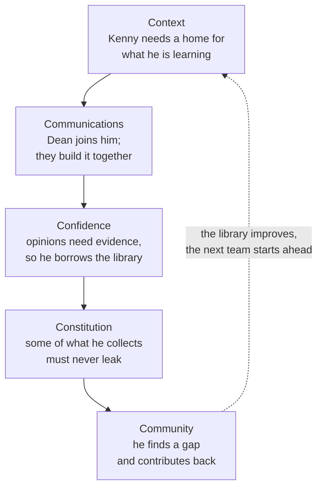

# The five plays as one story

**The spine and the runbook**

Not five demos. One person with one problem, five times.

```mermaid
flowchart TD
  P1["Context<br/>Kenny needs a home for<br/>what he is learning"]
  P2["Communications<br/>Dean joins him;<br/>they build it together"]
  P3["Confidence<br/>opinions need evidence,<br/>so he borrows the library"]
  P4["Constitution<br/>some of what he collects<br/>must never leak"]
  P5["Community<br/>he finds a gap<br/>and contributes back"]

  P1 --> P2 --> P3 --> P4 --> P5
  P5 -.->|"the library improves,<br/>the next team starts ahead"| P1
```

---

[All diagrams](INDEX.md) · [Runbook reading order](../diagrams.md)
