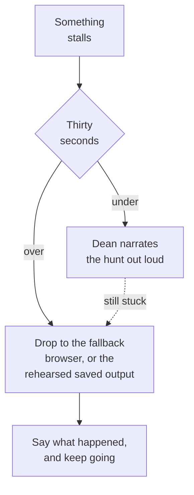

# When something breaks on camera

**The spine and the runbook**

The thirty-second rule. Dean's real job during the build.

**Never re-run a failed step live.** One attempt, then fallback. Owning it out loud is stronger than hiding it.

---

[All diagrams](INDEX.md) · [Runbook reading order](../diagrams.md)
