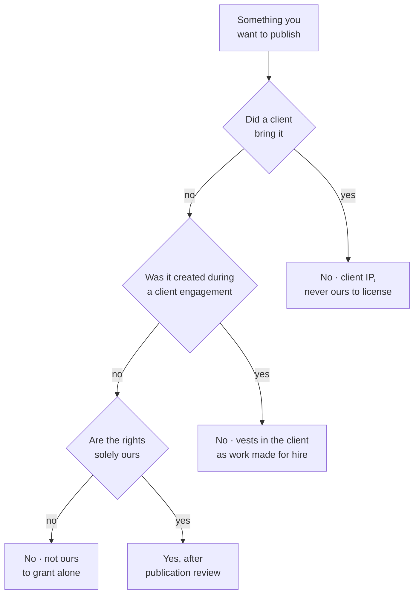

# Which materials may go public

**Guardrails and governance**

Productside's own classification. The category decides the answer far more often than the platform does.

**And the rule that governs the gray middle:** material published for public training may be published; bespoke customer material may not. Where something serves both, publish with public in mind and never identify a customer.

---

[All diagrams](INDEX.md) · [Diagram source](../diagrams.md)
