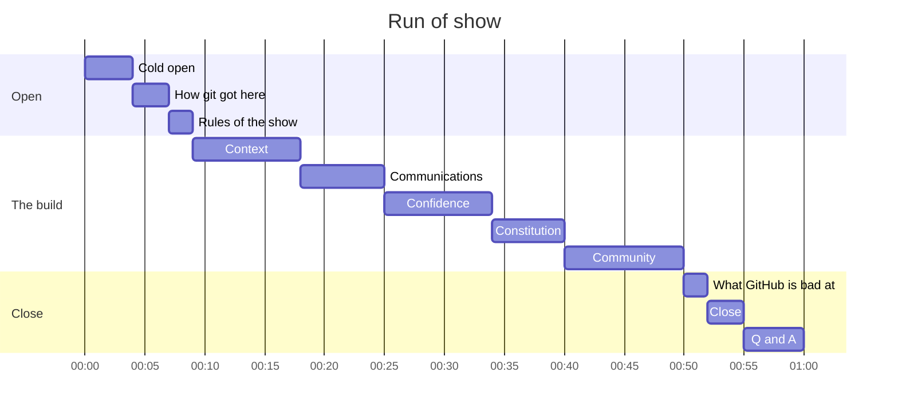

# The hour

**The spine and the runbook**

```mermaid
gantt
  title Run of show
  dateFormat HH:mm
  axisFormat %H:%M
  section Open
  Cold open              :00:00, 4m
  How git got here       :00:04, 3m
  Rules of the show      :00:07, 2m
  section The build
  Context                :00:09, 9m
  Communications         :00:18, 7m
  Confidence             :00:25, 9m
  Constitution           :00:34, 6m
  Community              :00:40, 10m
  section Close
  What GitHub is bad at  :00:50, 2m
  Close                  :00:52, 3m
  Q and A                :00:55, 5m
```

---

[All diagrams](INDEX.md) · [Runbook reading order](../diagrams.md)
