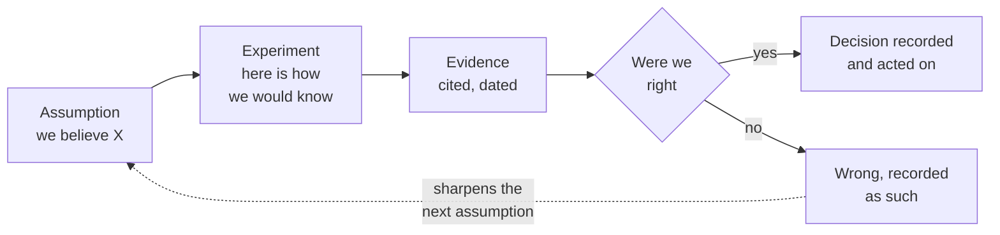

# Assumption to decision, connected

**Guardrails and governance**

**The one most teams cannot do:** the bottom path. A finding that says *we were wrong* is only valuable if it is findable later.

---

[All diagrams](INDEX.md) · [Runbook reading order](../diagrams.md)
