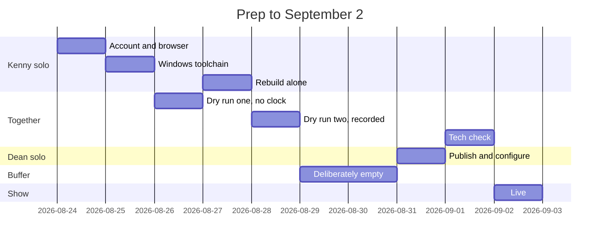

# Kenny's ten days

**The spine and the runbook**

```mermaid
gantt
  title Prep to September 2
  dateFormat YYYY-MM-DD
  section Kenny solo
  Account and browser      :2026-08-24, 1d
  Windows toolchain        :2026-08-25, 1d
  Rebuild alone            :2026-08-27, 1d
  section Together
  Dry run one, no clock    :2026-08-26, 1d
  Dry run two, recorded    :2026-08-28, 1d
  Tech check               :2026-09-01, 1d
  section Dean solo
  Publish and configure    :2026-08-31, 1d
  section Buffer
  Deliberately empty       :2026-08-29, 2d
  section Show
  Live                     :2026-09-02, 1d
```

---

[All diagrams](INDEX.md) · [Runbook reading order](../diagrams.md)
