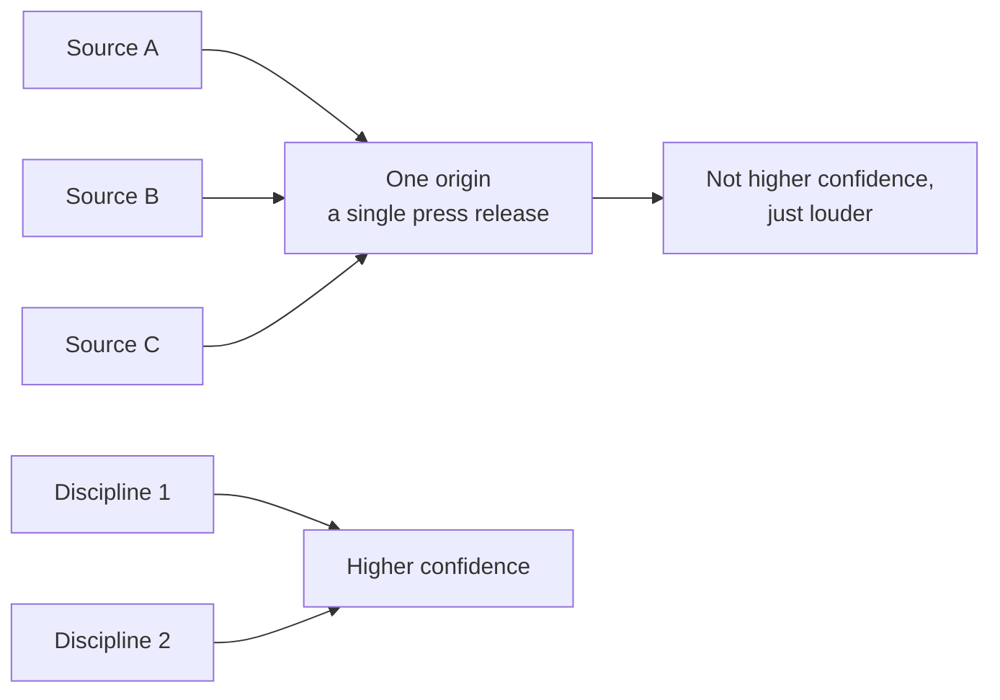

# Confidence stacks across independent sources

**Guardrails and governance**

Why six sources can be two disciplines — the trap the library exists to catch.

**The line:** stars are not market share, issue volume is not pain severity, commit velocity is not customer value. And beware the squeaky wheel.

---

---

[All diagrams](INDEX.md) · [Diagram source](../diagrams.md)
