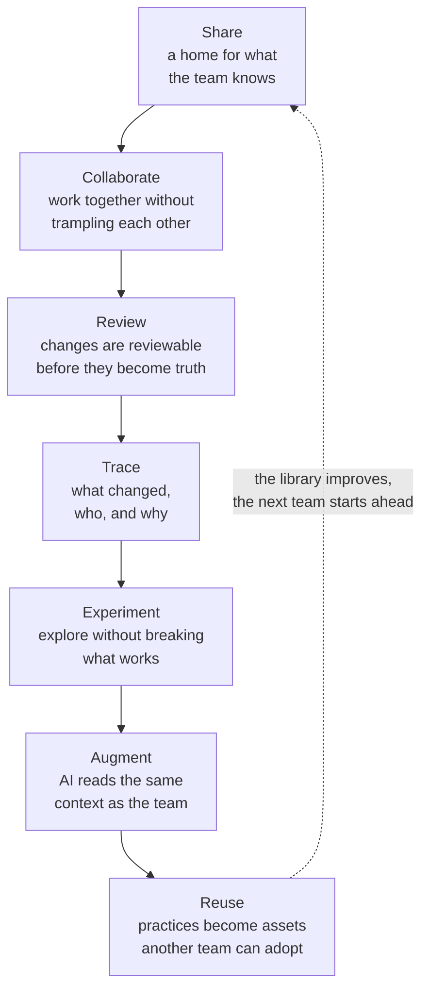

# The seven capabilities as one story

**The complete model**

Not seven demos. One team's thinking, compounding across seven capabilities.

---

[All diagrams](INDEX.md) · [Diagram source](../diagrams.md)
