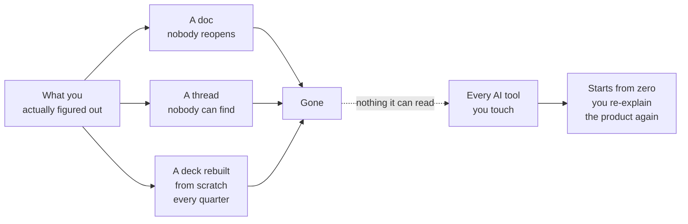

<svg xmlns="http://www.w3.org/2000/svg" viewBox="0 0 960 160" width="960" height="160">
  <rect width="960" height="160" rx="12" fill="#1a1a1a"/>
  <text x="48" y="100" font-family="system-ui, -apple-system, sans-serif" font-size="44" font-weight="700" fill="#FFFFFF" text-anchor="start">Your best thinking dies</text>
  <text x="48" y="140" font-family="system-ui, -apple-system, sans-serif" font-size="44" font-weight="700" fill="#FFFFFF" text-anchor="start">in three places.</text>
  <text x="912" y="140" font-family="system-ui, -apple-system, sans-serif" font-size="14" fill="#94D2BD" text-anchor="end">Productside</text>
</svg>

&nbsp;

&nbsp;

Nothing you know lives anywhere your tools can find it.

&nbsp;

---

Beyond the Backlog: Five GitHub Plays for Product Teams · Productside · September 2, 2026

---

[Next: How we got here &rarr;](01_how-we-got-here.md) · [Run](run.md)
