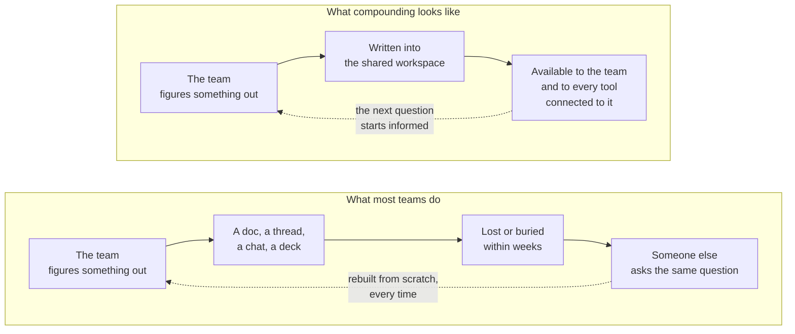
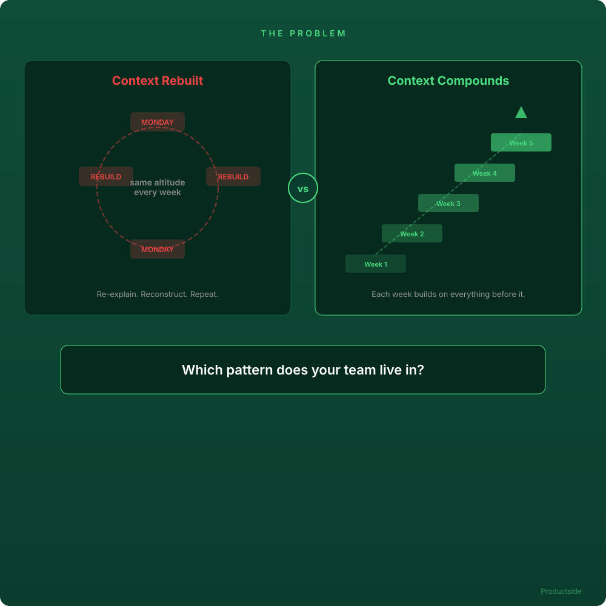

<svg xmlns="http://www.w3.org/2000/svg" viewBox="0 0 960 160" width="960" height="160">
  <rect width="960" height="160" rx="12" fill="#1a1a1a"/>
  <text x="48" y="100" font-family="system-ui, -apple-system, sans-serif" font-size="44" font-weight="700" fill="#FFFFFF" text-anchor="start">Does your product team have a</text>
  <text x="48" y="140" font-family="system-ui, -apple-system, sans-serif" font-size="44" font-weight="700" fill="#FFFFFF" text-anchor="start">place where its thinking compounds?</text>
  <text x="912" y="140" font-family="system-ui, -apple-system, sans-serif" font-size="14" fill="#94D2BD" text-anchor="end">Productside</text>
</svg>

&nbsp;

&nbsp;

&nbsp;

Most product teams do not struggle because they lack effort. They struggle because clarity is missing. The question is whether your team's knowledge gets rebuilt every week or whether it compounds over time.

&nbsp;

---

Beyond the Backlog · Productside · September 2, 2026

---

[Next: The comparison &rarr;](01_the-comparison.md) · [Run](run.md)
