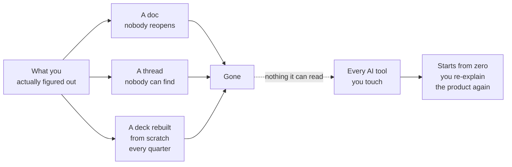

<svg xmlns="http://www.w3.org/2000/svg" viewBox="0 0 960 160" width="960" height="160"><rect width="960" height="160" rx="12" fill="#1a1a1a"/><text x="48" y="100" font-family="system-ui, -apple-system, sans-serif" font-size="44" font-weight="800" fill="#FFFFFF" text-anchor="start">Collaboration Pains</text></svg>

## The Three Dysfunctions

Every product team has felt these, even if they have never named them.

**Versioning Hell.** You open a document called `Strategy_v3_FINAL_deanedits_USE_THIS_ONE.docx` and wonder whether it is actually the one. Someone else edited a copy last Tuesday. A third version lives in a Slack thread. None of them agree. The file system was supposed to keep track of versions, and it did not, because naming conventions are not version control. They are hopes.

**The Context Scavenger Hunt.** A new team member asks why the pricing model changed. The answer lives partly in a Confluence page last updated eight months ago, partly in a Slack thread between two people who have since changed teams, and partly in the head of someone who is on vacation. The decision was good. The reasoning was never written down in a place anyone could find it.

**Individual Realities.** Each person on the team carries a slightly different mental model of the product. The PM thinks the priority is retention. Engineering thinks it is performance. Design thinks it is onboarding. Nobody is wrong, exactly. They are just working from different snapshots of a conversation that never reached a shared, written conclusion.

These are not personality problems. They are infrastructure problems. The team does not have a place where thinking compounds.

## The Five Collaborative Pains

The three dysfunctions produce five recurring costs. You pay them every week, sometimes every day.

**Copying Context.** You paste the same background into every AI prompt, every kickoff doc, every stakeholder email. The product does not change that fast. Your explanation of it shouldn't need to be rebuilt from scratch every time.

**Relitigating Decisions.** A decision was made. Someone missed the meeting. Now the decision is open again, not because new information surfaced, but because the record of the old decision is invisible.

**Redoing Discovery.** Research was done. Interviews were conducted. Findings were written up. Six months later, a new initiative overlaps with that research, and nobody can find it. So the team commissions the same study again.

**Remembering the Rules.** Every product has constraints: regulatory requirements, brand guidelines, architectural limits, commitments to customers. These rules live in scattered documents. When someone forgets one, the team learns about it in a review meeting, or worse, in production.

**Losing Unexplored Ideas.** Someone had a good idea in a brainstorm. It did not make the cut for this quarter. It was never written down anywhere durable. Next quarter, the same idea comes up again, and no one remembers the first conversation or the reasons it was deferred.

## Does Your Product Team Have a Place Where Its Thinking Can Compound?

This is the question that sits underneath all five pains. Not "do you have enough tools." Not "do you need better process." The question is whether the things you figure out today are still available to you and your team next month, in a form that is findable, readable, and connected to the decisions that came from them.

Most teams do not. Most teams have a collection of documents that were useful once and are now archaeology.

The diagram is blunt on purpose. The thinking dies in three different containers, all of which were supposed to preserve it. And the AI tools that promise to help? They start from zero every session because they cannot read what the team already knows. You re-explain the product. Again. Every morning.

The rest of this webinar is about what happens when you give the team a place where thinking compounds instead of evaporates.

---

Next &rarr; [Collaborative Journey](02_collaborative-journey.md) &middot; [Run](run.md)

Beyond the Backlog &middot; Productside &middot; September 2, 2026
