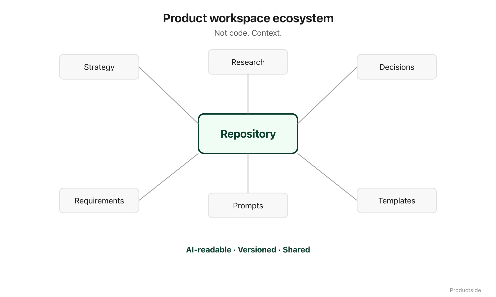

<svg xmlns="http://www.w3.org/2000/svg" viewBox="0 0 960 160" width="960" height="160">
  <rect width="960" height="160" rx="12" fill="#1a1a1a"/>
  <text x="48" y="58" font-family="system-ui, -apple-system, sans-serif" font-size="16" font-weight="600" letter-spacing="3" fill="#94D2BD" text-anchor="start">GITHUB FOR PRODUCT MANAGERS</text>
  <text x="48" y="108" font-family="system-ui, -apple-system, sans-serif" font-size="48" font-weight="700" fill="#FFFFFF" text-anchor="start">Not code.</text>
  <text x="48" y="148" font-family="system-ui, -apple-system, sans-serif" font-size="48" font-weight="700" fill="#FFFFFF" text-anchor="start">Context.</text>
  <text x="912" y="140" font-family="system-ui, -apple-system, sans-serif" font-size="14" fill="#94D2BD" text-anchor="end">Productside</text>
</svg>

&nbsp;

## GitHub for Product Managers

GitHub can be a shared, versioned, AI-ready workspace for product teams. Not a developer tool you tolerate. Not a place you visit to approve pull requests you do not understand. A workspace where product thinking lives, evolves, and compounds over time.

&nbsp;

&nbsp;

Product work is changing. Strategy documents, research findings, positioning drafts, prompt libraries, decision records: the artifacts that define what you are building and why are multiplying faster than any team's ability to keep them organized.

The problem is not volume. The problem is scatter. Your research lives in one tool. Your decisions live in another. Your AI prompts live on someone's laptop. Your requirements doc has three versions and nobody knows which one is current.

In plain English: your product context is leaking, and every tool you add makes the leak worse unless the tool gives you a shared ground floor.

GitHub is not magic. It is a versioned, reviewable, AI-readable layer where the work that defines your product can live in one place, with history, with structure, and with the ability for your AI tools to read it without you re-explaining everything from scratch.

> **"GitHub is a context story, not a code story."**

&nbsp;

---

Beyond the Backlog · Productside · September 2, 2026

---

[Next: The Real Problem →](02_the-real-problem.md) · [Run](run.md)
