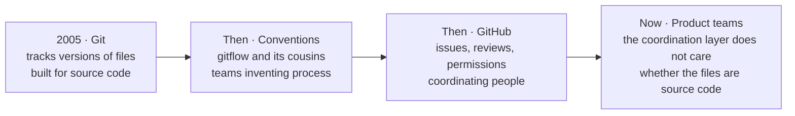

<svg xmlns="http://www.w3.org/2000/svg" viewBox="0 0 960 160" width="960" height="160"><rect width="960" height="160" rx="12" fill="#FFFFFF" stroke="#E5E7EB"/><text x="48" y="100" font-family="system-ui, -apple-system, sans-serif" font-size="36" font-weight="800" fill="#1a1a1a" text-anchor="start">Collaborative Journey</text></svg>

## WF1: Install Git and Set Up GitHub Access

Before anything else, the machine needs two things: Git (the version-tracking engine that runs locally) and the GitHub CLI (the tool that talks to GitHub without opening a browser). Most Macs and many Windows machines already have Git. The point of this workflow is not to teach installation; it is to hand the entire job to an AI assistant so you never see a terminal if you do not want to.

In plain English: you are asking the AI to check your toolkit and fill in anything missing. If Git is already there, it skips it. If the GitHub CLI is already there, it skips that too. The only thing you need to provide is your name and email for Git's configuration, so your commits carry your identity rather than "Unknown User."

> **AI Prompt**
>
> "Check whether Git and the GitHub CLI are already installed on my device. If anything is missing, install it. Then help me configure Git with my name and email and sign into GitHub."

### Invisible Machinery

What the AI does behind the scenes depends on the operating system:

**On Windows:**
```
winget install --id Git.Git -e --source winget
winget install --id GitHub.cli -e --source winget
git config --global user.name "Your Name"
git config --global user.email "you@example.com"
gh auth login
```

**On Mac:**
```
brew install git
brew install gh
git config --global user.name "Your Name"
git config --global user.email "you@example.com"
gh auth login
```

You do not need to memorize any of this. The AI reads the system, picks the right installer, runs the commands, and confirms when it is done. If something is already installed, it says so and moves on.

### Adoption and Limits

**Use this when** the team member is setting up a new machine or has never used Git before.

**Skip it when** Git and the GitHub CLI are already installed and authenticated. The AI will tell you if that is the case.

**What it does not do:** It does not create a GitHub account for you. You need a GitHub account before `gh auth login` can work. If you do not have one, go to github.com and sign up first.

## The Five-Step Learning Path

The rest of this webinar follows a deliberate progression. Each step builds on the one before it, and each one is safe to try without breaking anything.

1. **Share** -- Get shared context into a place where the whole team, and every AI tool, can read it.
2. **Collaborate** -- Give AI the same context as the team so it stops starting from zero.
3. **Experiment** -- Make changes on a branch where mistakes cost nothing.
4. **Review** -- Let the team see what changed, why, and whether it is better.
5. **Reuse** -- Turn one team's improvement into something the whole organization can install.

Each step maps to one or more workflows. Each workflow has an AI prompt you can say out loud. Nobody types a git command.

## Why GitHub? Three Pillars

There are a lot of collaboration tools. The reason GitHub works differently for product teams comes down to three things that no other tool combines in the same way.

**Shared Versioned Context.** Not just "we all have access to the same folder." Every change is recorded with who made it, when, and why. The history is not a log you have to dig through; it is the structure of the workspace itself. When you open a file, you can see every version it has ever been, and the reasoning behind each change.

**Safe Collaboration and Experimentation.** Branches let you try something without touching the version the team trusts. If the experiment works, you merge it. If it does not, you delete the branch. Main never knew the experiment happened. This is not how most document tools work. In most tools, you either edit the live version or you create a copy and lose track of which one is current.

**AI-Ready Reusable Workspace.** A GitHub repository is a structured directory that any AI tool can read. CLAUDE.md files tell AI what the project is. CONSTITUTION.md files tell it what it must not do. Skills and prompts are files, not ephemeral chat messages. When you give an AI tool a repository, you are not giving it a pile of files. You are giving it a workspace with rules, context, and memory that persists across sessions.



This diagram is Dean's three-minute history, compressed. Git was built for source code. Then teams layered conventions on top. Then GitHub added a coordination layer: issues, pull requests, permissions, reviews. And now product teams are discovering that the coordination layer does not care whether the files are source code. It works the same way for strategy documents, research findings, battle cards, and positioning frameworks.

---

&larr; [Collaboration Pains](01_collaboration-pains.md) &middot; Next &rarr; [Collaborative Sharing](03_collaborative-sharing.md) &middot; [Run](run.md)

Beyond the Backlog &middot; Productside &middot; September 2, 2026
